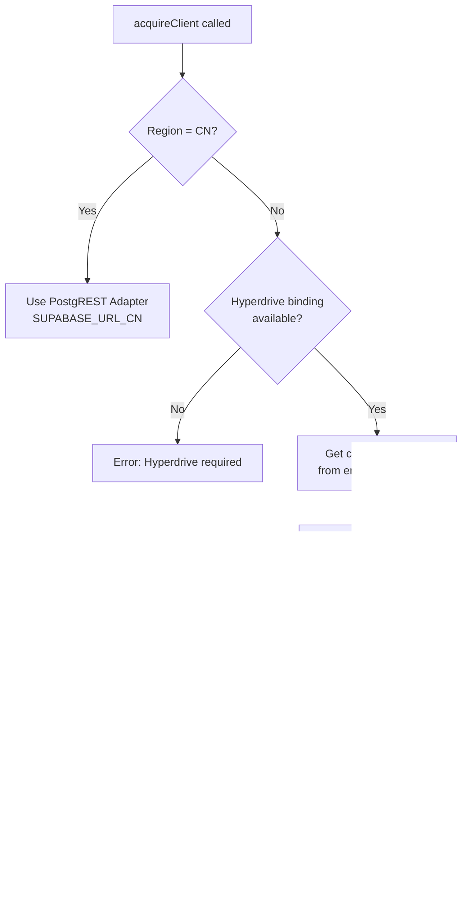
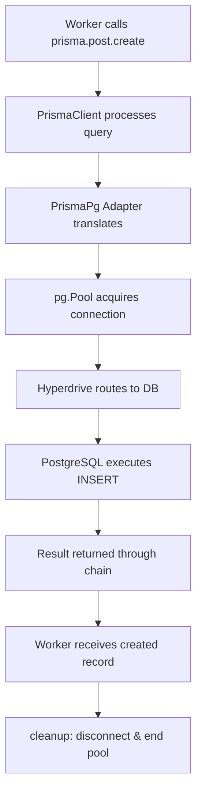

# Worker Database Connection and Write Flow

This document visualizes how a Cloudflare Worker instance acquires a database connection and writes to the database using Hyperdrive, Prisma, and PostgreSQL.

## Architecture Overview

Cloudflare Workers are stateless by design. Each Worker invocation creates a fresh database connection through Hyperdrive, which manages global connection pooling. The Worker's `pg.Pool` is just a local interface to Hyperdrive's global connection pool.

## Connection and Write Flow Diagram

```mermaid
sequenceDiagram
    participant Request as HTTP Request
    participant Worker as Worker Instance
    participant DCM as DatabaseConnectionManager
    participant Hyperdrive as Hyperdrive Binding
    participant Pool as pg.Pool
    participant Adapter as PrismaPg Adapter
    participant Prisma as PrismaClient
    participant DB as PostgreSQL Database

    Request->>Worker: Incoming Request
    activate Worker

    Worker->>DCM: acquireClient(region, env)
    activate DCM

    DCM->>DCM: resolveConnectionStrings(region, env)
    Note over DCM: Check for HYPERDRIVE binding<br/>Required for Cloudflare Workers

    alt Hyperdrive Available
        DCM->>Hyperdrive: Get connectionString
        activate Hyperdrive
        Hyperdrive-->>DCM: postgresql://[id].hyperdrive.workers.dev:5432/...
        deactivate Hyperdrive
    else Hyperdrive Not Available
        DCM-->>Worker: Error: Hyperdrive binding required
        deactivate DCM
        Worker-->>Request: 500 Internal Server Error
        deactivate Worker
    end

    DCM->>Pool: new Pool({<br/>  connectionString: hyperdriveString,<br/>  max: POOL_MAX_CONNECTIONS,<br/>  connectionTimeoutMillis: 5000<br/>})
    activate Pool

    Note over Pool: Pool connects to Hyperdrive<br/>(not directly to database)
    Pool->>Hyperdrive: Establish connection
    activate Hyperdrive
    Hyperdrive->>DB: Route to actual DB connection<br/>(from global pool)
    activate DB
    DB-->>Hyperdrive: Connection established
    deactivate DB
    Hyperdrive-->>Pool: Connection ready
    deactivate Hyperdrive

    DCM->>Adapter: new PrismaPg(pool)
    activate Adapter
    Adapter->>Pool: Register with pool
    deactivate Adapter

    DCM->>Prisma: new PrismaClient({ adapter })
    activate Prisma
    Prisma->>Adapter: Link to adapter
    deactivate Prisma

    DCM-->>Worker: { client: PrismaClient, cleanup: fn }
    deactivate DCM

    Note over Worker: Worker uses PrismaClient<br/>to execute queries

    Worker->>Prisma: prisma.post.create({ data })
    activate Prisma
    Prisma->>Adapter: Execute query
    activate Adapter
    Adapter->>Pool: Get connection from pool
    activate Pool
    Pool->>Hyperdrive: Request connection
    activate Hyperdrive
    Hyperdrive->>DB: Route query to database
    activate DB
    DB->>DB: Execute INSERT/UPDATE/DELETE
    DB-->>Hyperdrive: Query result
    deactivate DB
    Hyperdrive-->>Pool: Return result
    deactivate Hyperdrive
    Pool-->>Adapter: Query result
    deactivate Pool
    Adapter-->>Prisma: Query result
    deactivate Adapter
    Prisma-->>Worker: Created/Updated record
    deactivate Prisma

    Worker->>DCM: cleanup()
    activate DCM
    DCM->>Prisma: $disconnect()
    activate Prisma
    Prisma->>Adapter: Disconnect
    activate Adapter
    Adapter->>Pool: Release connections
    activate Pool
    Pool->>Hyperdrive: Release connection
    activate Hyperdrive
    Hyperdrive->>Hyperdrive: Return to global pool
    deactivate Hyperdrive
    deactivate Pool
    deactivate Adapter
    deactivate Prisma
    DCM->>Pool: pool.end()
    activate Pool
    Pool->>Pool: Close all connections
    deactivate Pool
    deactivate DCM

    Worker-->>Request: Response with data
    deactivate Worker
```

## UML Sequence Diagram (Mermaid)

```mermaid
sequenceDiagram
    participant Request as HTTP Request
    participant Worker as Worker Instance
    participant DCM as DatabaseConnectionManager
    participant Hyperdrive as Hyperdrive Binding
    participant Pool as pg.Pool
    participant Adapter as PrismaPg Adapter
    participant Prisma as PrismaClient
    participant DB as PostgreSQL Database

    rect rgb(240, 248, 255)
        Note over Request,DB: Request Processing
        Request->>Worker: Incoming HTTP Request
        activate Worker
    end

    rect rgb(240, 255, 240)
        Note over Request,DB: Connection Acquisition
        Worker->>DCM: acquireClient(region, env)
        activate DCM

        DCM->>DCM: resolveConnectionStrings(region, env)
        Note over DCM: Check for HYPERDRIVE binding<br/>Required for Cloudflare Workers

        alt Hyperdrive Available
            DCM->>Hyperdrive: Get connectionString
            activate Hyperdrive
            Hyperdrive-->>DCM: postgresql://[id].hyperdrive.workers.dev:5432/...
            deactivate Hyperdrive
        else Hyperdrive Not Available
            DCM-->>Worker: Error: Hyperdrive binding required
            Worker-->>Request: 500 Internal Server Error
            deactivate Worker
        end
    end

    rect rgb(255, 250, 240)
        Note over Request,DB: Pool Creation
        DCM->>Pool: new Pool(connectionString, max, timeout)
        activate Pool
        Note over Pool: Pool connects to Hyperdrive<br/>(not directly to database)

        Pool->>Hyperdrive: Establish connection
        activate Hyperdrive
        Hyperdrive->>DB: Route to actual DB connection<br/>(from global pool)
        activate DB
        DB-->>Hyperdrive: Connection established
        deactivate DB
        Hyperdrive-->>Pool: Connection ready
        deactivate Hyperdrive
    end

    rect rgb(255, 240, 255)
        Note over Request,DB: Adapter and Client Creation
        DCM->>Adapter: new PrismaPg(pool)
        activate Adapter
        Adapter->>Pool: Register with pool
        deactivate Adapter

        DCM->>Prisma: new PrismaClient({ adapter })
        activate Prisma
        Prisma->>Adapter: Link to adapter
        deactivate Prisma

        DCM-->>Worker: { client: PrismaClient, cleanup: fn }
        deactivate DCM
    end

    rect rgb(240, 255, 255)
        Note over Request,DB: Database Write Operation
        Note over Worker: Worker uses PrismaClient<br/>to execute queries

        Worker->>Prisma: prisma.post.create({ data })
        activate Prisma

        Prisma->>Adapter: Execute query
        activate Adapter

        Adapter->>Pool: Get connection from pool
        activate Pool

        Pool->>Hyperdrive: Request connection
        activate Hyperdrive

        Hyperdrive->>DB: Route query to database
        activate DB

        DB->>DB: Execute INSERT/UPDATE/DELETE
        DB-->>Hyperdrive: Query result
        deactivate DB

        Hyperdrive-->>Pool: Return result
        deactivate Hyperdrive

        Pool-->>Adapter: Query result
        deactivate Pool

        Adapter-->>Prisma: Query result
        deactivate Adapter

        Prisma-->>Worker: Created/Updated record
        deactivate Prisma
    end

    rect rgb(255, 240, 240)
        Note over Request,DB: Cleanup
        Worker->>DCM: cleanup()
        activate DCM

        DCM->>Prisma: $disconnect()
        activate Prisma
        Prisma->>Adapter: Disconnect
        activate Adapter
        Adapter->>Pool: Release connections
        activate Pool
        Pool->>Hyperdrive: Release connection
        activate Hyperdrive
        Hyperdrive->>Hyperdrive: Return to global pool
        deactivate Hyperdrive
        deactivate Pool
        deactivate Adapter
        deactivate Prisma

        DCM->>Pool: pool.end()
        activate Pool
        Pool->>Pool: Close all connections
        deactivate Pool
        deactivate DCM
    end

    rect rgb(240, 248, 255)
        Note over Request,DB: Response
        Worker-->>Request: Response with data
        deactivate Worker
    end
```

## Key Components

### 1. Worker Instance

- Stateless by design
- Each invocation is independent
- Creates fresh database clients per request

### 2. DatabaseConnectionManager

- Manages connection lifecycle
- Resolves connection strings (Hyperdrive vs direct)
- Creates and manages `pg.Pool` instances
- Provides cleanup hooks

### 3. Hyperdrive Binding

- Cloudflare's connection pooling service
- Maintains global pool of database connections
- Routes Worker connections to actual database
- Ensures connections are never stale
- Optimally located (close to database)

### 4. pg.Pool

- Local interface to Hyperdrive
- Created fresh per Worker invocation
- Uses `max: POOL_MAX_CONNECTIONS` (typically 1-2)
- Hyperdrive handles actual pooling globally

### 5. PrismaPg Adapter

- Bridges PrismaClient to pg.Pool
- Handles query translation
- Manages connection lifecycle

### 6. PrismaClient

- Type-safe database client
- Created fresh per request
- Lightweight (minimal overhead)
- Executes queries through adapter

## Connection String Resolution



## Write Operation Flow



## Important Notes

1. **Fresh Connections Per Invocation**: Each Worker invocation creates a fresh `Pool` and `PrismaClient`. This prevents stale connections.

2. **Hyperdrive Handles Pooling**: The Worker's `pg.Pool` is just a local interface. Hyperdrive maintains the actual global connection pool.

3. **Connection Timeout**: 5 seconds (5000ms) - fail fast if connection cannot be established.

4. **Statement Timeout**: 10 seconds (10000ms) - database-level query timeout.

5. **Cleanup**: Always called in `finally` block to ensure connections are released.

6. **No Caching**: Pools and PrismaClients are NOT cached across invocations (Workers are stateless).

## Error Handling

- **Hyperdrive Unavailable**: Returns error immediately - Hyperdrive binding is required
- **Connection Timeout**: Fails after 5 seconds
- **Query Timeout**: Fails after statement timeout (10s) or custom timeout
- **Retry Logic**: `executeWithRetry` handles transient failures with exponential backoff
