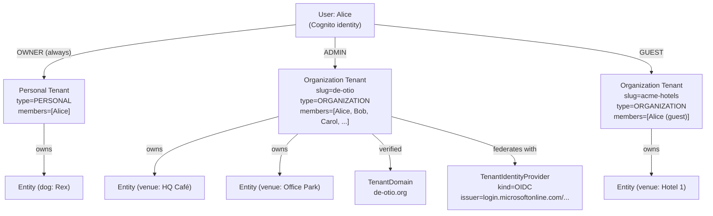
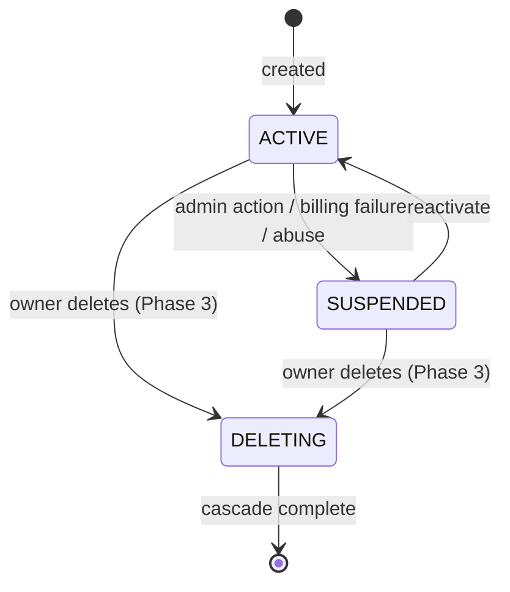

# Tenancy Model

## What is a Tenant?

A **Tenant** is the unit of:

- **Identity federation** — at most one external IdP per tenant in MVP.
- **Domain ownership** — one or more verified domains per tenant.
- **Resource scope** — every entity, post, group, connection code, and ownership row belongs to exactly one tenant.
- **Role assignment** — roles and permissions are scoped to a tenant.
- **Audit log scope** — security events are filtered by tenant for tenant admins; all events flow to the platform admin log.
- **Billing** — Phase 3. One subscription per tenant.

Examples of tenants:

- **de otio** — the company that owns Trellis. Federates with Entra. ~5–20 employees with varying roles.
- **A hotel chain** (hypothetical Phase 2 partner) — federates with their corporate Okta. Multiple staff per location.
- **An independent café** (hypothetical Phase 2 partner) — single owner. No federation; password auth.
- **An end consumer** (B2C user) — implicit personal tenant created at sign-up. One member: themselves.

## Tenant types

Two enum values capture the operational difference:

```typescript
enum TenantType {
  PERSONAL      // Auto-created on consumer sign-up. One member. Not invitable.
  ORGANIZATION  // Explicitly created by a user. Multiple members. Federates.
}
```

A personal tenant exists for every user — even consumers — to keep the data model uniform. Their dog entities, posts, and connection codes all live under their personal tenant. There is no "tenantless" data.

A user is **always** a member of their personal tenant and **may** be a member of zero or more organization tenants.

## Hierarchy



## Why flat (no org → site like Atlassian)

Atlassian's `Organization → Site → Product` exists because:

1. Atlassian sells multiple products (Jira, Confluence, Bitbucket, Trello).
2. A customer often wants the same product in multiple branded URLs (`engineering.atlassian.net`, `marketing.atlassian.net`).

Trellis has neither requirement: one app, one URL per tenant. The `Site` layer would be dead weight.

If a future product split materializes (Trellis + a separate B2B vertical app), revisit. Until then: a flat `Tenant` is the cleanest model.

## Single-active-tenant principle

A user can be a member of multiple tenants but is **active in exactly one at a time**.

- The **active tenant** is what the API treats as the resource scope for that request.
- It's carried in the JWT as `custom:activeTenantId`.
- Switching tenants is a deliberate action: user calls `POST /api/auth/switch-tenant` → server validates membership → next token refresh carries the new tenant ID.
- A user *cannot* read data from a tenant they're not currently active in, even if they're a member. (They have to switch first.)

This avoids two problems:

- **Authorization complexity.** Every endpoint scopes to one tenant ID, sourced from the JWT. There's no per-request "for tenant X please" header that route handlers must validate.
- **Cross-tenant data leakage.** A buggy filter that omits a tenant predicate is automatically scoped because the active tenant is in the auth context.

The trade-off is UX — switching tenants takes a token refresh (~1 second). For MVP, this is fine. Slack Discord and many SaaS apps do this.

## Resource ownership rule

> **Every resource owned by a tenant has a non-nullable `tenantId` foreign key.**

Resources affected:
- `Entity` (a dog, venue, etc.)
- `Post`, `PostComment`
- `Group`, `GroupMember`
- `ConnectionCode`, `ConnectionCodeRedemption`
- `EntityOwnership`
- `Notification`

Cross-cutting tables that *aren't* tenant-scoped (and why):
- `User` — a user is a global identity; they belong to N tenants. Tenant membership is on `TenantMember`.
- `MediaFile` — content-addressed; deduplication across tenants is fine.
- `FeatureToggle` — platform-wide.
- `RoleMetadata` — global UserRole catalog.

## Tenant lifecycle



- **ACTIVE** — normal operation. Members can sign in.
- **SUSPENDED** — sign-in blocked, data preserved. Used for billing failures and abuse holds. MVP exposes this state but provides no automated reactivation.
- **DELETING / DELETED** — Phase 3. Cascade-delete via SQS pipeline analogous to `delete-account` Lambda.

For MVP, the only state machine path used is `ACTIVE`. `SUSPENDED` exists as schema-prep for the abuse path; deletion is deferred entirely.

## Personal tenant invariants

A personal tenant has tighter rules than an organization tenant:

| Property | Personal | Organization |
|---|---|---|
| Members | exactly 1 (the owner) | 1 or more |
| `slug` | derived from username/handle | user-chosen, must be globally unique |
| Federated IdP | not allowed | optional |
| Verified domains | not allowed | 0 or more |
| Renamable | yes (slug change) | yes |
| Deletable | only via "delete account" flow | only by OWNER |
| Visible in tenant switcher | always shown for the user | shown when the user is an active member |

A user cannot demote, suspend, or remove their own personal tenant in isolation. It's deleted as part of full account deletion.

## Comparison to existing `Partner` model

The schema today has a stub `Partner` model ([`prisma/schema.prisma:744`](../../../prisma/schema.prisma#L744)). It has only `id`, `name`, `createdAt` and a `users` relation. **It's a placeholder; we replace it with the new `Tenant` model.**

Migration plan: greenfield. Trellis has no live deployments yet (it ships as `@de-otio/trellis` on npm; consumers are pre-launch), so we drop `Partner` outright in the same migration that introduces `Tenant`. No backfill needed. See [02-data-model.md](./02-data-model.md) §Migration-strategy.

## Glossary anchor

These terms appear throughout the rest of this folder. They're defined here once.

- **Tenant** — the top-level container described above.
- **Personal tenant** — an auto-created tenant of `type=PERSONAL` for an individual user.
- **Organization tenant** — an explicitly-created tenant of `type=ORGANIZATION`.
- **TenantMember** — the join row linking a User to a Tenant with a role.
- **TenantDomain** — a verified DNS domain owned by a tenant.
- **TenantIdentityProvider** — the configured external IdP for a tenant (Cognito-side IdP record + Trellis-side metadata).
- **TenantRole** — the role a user holds *within* a tenant: `OWNER`, `ADMIN`, `MEMBER`, `GUEST`.
- **Active tenant** — the tenant whose context the user's current session is operating under.
- **Discovery** — the lookup of "given an email or domain, where do we send the user to authenticate?"
- **JIT** — just-in-time user provisioning: a User row is created on the first successful federated authentication.
