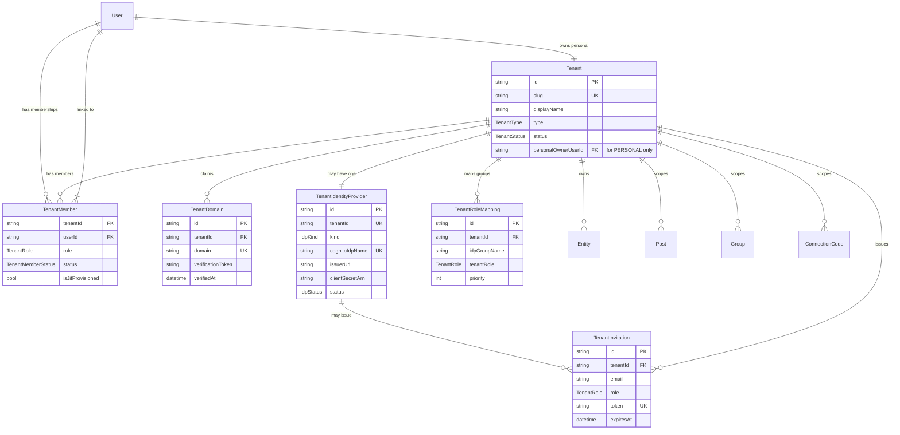

# Data Model

Prisma schema additions to support multi-tenancy and IdP federation. Companion to [01-tenancy-model.md](./01-tenancy-model.md).

## Diagram



## Prisma additions

### `Tenant`

```prisma
model Tenant {
  id            String        @id @default(cuid())
  slug          String        @unique // url-safe, 3–32 chars, [a-z0-9-]
  displayName   String        @map("display_name")
  type          TenantType
  status        TenantStatus  @default(ACTIVE)

  // For PERSONAL tenants only — the single owner. Always equals the User.id who created it.
  // For ORGANIZATION tenants this is null; ownership is encoded via TenantMember.role=OWNER.
  personalOwnerUserId String? @unique @map("personal_owner_user_id")

  createdAt     DateTime      @default(now()) @map("created_at")
  updatedAt     DateTime      @updatedAt @map("updated_at")
  suspendedAt   DateTime?     @map("suspended_at")
  suspendReason String?       @map("suspend_reason")

  // Relations
  members           TenantMember[]
  domains           TenantDomain[]
  identityProvider  TenantIdentityProvider?
  roleMappings      TenantRoleMapping[]
  invitations       TenantInvitation[]
  entities          Entity[]
  posts             Post[]
  groups            Group[]
  connectionCodes   ConnectionCode[]

  @@index([slug])
  @@index([type, status])
  @@map("tenants")
}

enum TenantType {
  PERSONAL
  ORGANIZATION
}

enum TenantStatus {
  ACTIVE
  SUSPENDED
  DELETING  // Phase 3 — soft state during cascade-delete
}
```

### `TenantMember`

```prisma
model TenantMember {
  id        String              @id @default(cuid())
  tenantId  String              @map("tenant_id")
  userId    String              @map("user_id")
  role      TenantRole
  status    TenantMemberStatus  @default(ACTIVE)

  // Provenance
  isJitProvisioned Boolean      @default(false) @map("is_jit_provisioned")
  invitedByUserId  String?      @map("invited_by_user_id")
  invitedAt        DateTime?    @map("invited_at")
  joinedAt         DateTime?    @map("joined_at")
  removedAt        DateTime?    @map("removed_at")
  lastActiveAt     DateTime?    @map("last_active_at")

  tenant    Tenant @relation(fields: [tenantId], references: [id], onDelete: Cascade)
  user      User   @relation("TenantMemberships", fields: [userId], references: [id], onDelete: Cascade)
  invitedBy User?  @relation("TenantInvitedBy", fields: [invitedByUserId], references: [id])

  @@unique([tenantId, userId])
  @@index([userId])
  @@index([tenantId, status])
  @@index([tenantId, role])
  @@map("tenant_members")
}

enum TenantRole {
  OWNER  // exactly one per organization tenant; cannot be removed without transfer
  ADMIN  // manages members, IdP config, domains, billing (Phase 3)
  MEMBER // posts and uses entities within tenant scope
  GUEST  // read-only or restricted (Phase 2; not enforced in MVP)
}

enum TenantMemberStatus {
  INVITED   // invitation issued, not yet accepted
  ACTIVE
  SUSPENDED // tenant admin paused this member
  REMOVED
}
```

### `TenantDomain`

```prisma
model TenantDomain {
  id                  String    @id @default(cuid())
  tenantId            String    @map("tenant_id")
  domain              String    @unique // e.g. "de-otio.org"; lowercased; no protocol
  verificationToken   String    @map("verification_token") // random 32-char token, hex
  verifiedAt          DateTime? @map("verified_at")
  verifyAttemptedAt   DateTime? @map("verify_attempted_at")
  verifyAttempts      Int       @default(0) @map("verify_attempts")
  createdAt           DateTime  @default(now()) @map("created_at")

  tenant Tenant @relation(fields: [tenantId], references: [id], onDelete: Cascade)

  @@index([tenantId])
  @@index([verifiedAt])
  @@map("tenant_domains")
}
```

A tenant may claim multiple domains (e.g. `de-otio.org` + `deotio.com`). Verification is per-domain. Routing on email-domain to the tenant's IdP works as long as the email domain matches any verified domain on the tenant.

### `TenantIdentityProvider`

```prisma
model TenantIdentityProvider {
  id              String    @id @default(cuid())
  tenantId        String    @unique @map("tenant_id")

  kind            IdpKind
  // Cognito's IdP record name. Constraint: max 32 chars (Cognito quota), unique within the user pool.
  // Convention: "tenant-{tenantId-first-12-chars}"
  cognitoIdpName  String    @unique @map("cognito_idp_name")

  // SAML configuration
  metadataUrl     String?   @map("metadata_url")     // public XML metadata URL (preferred — auto-refresh)
  metadataXml     String?   @map("metadata_xml")     @db.Text // pasted XML if no URL

  // OIDC configuration
  issuerUrl       String?   @map("issuer_url")       // e.g. https://login.microsoftonline.com/{tenantGuid}/v2.0
  clientId        String?   @map("client_id")
  // OIDC client secret never stored in Postgres. We hold an ARN to a Secrets Manager secret.
  clientSecretArn String?   @map("client_secret_arn")
  // Scopes requested from the IdP (default: "openid email profile groups")
  scopes          String    @default("openid email profile groups")

  // Attribute mapping from IdP claims to Cognito user attributes (JSON object).
  // Keys are Cognito attribute names; values are IdP claim names.
  // Example: { "email": "email", "given_name": "given_name", "custom:groups": "groups" }
  attributeMapping Json     @default("{}") @map("attribute_mapping")

  status      IdpStatus  @default(PENDING)
  enabledAt   DateTime?  @map("enabled_at")
  lastError   String?    @map("last_error") @db.Text
  lastErrorAt DateTime?  @map("last_error_at")

  createdAt   DateTime   @default(now()) @map("created_at")
  updatedAt   DateTime   @updatedAt @map("updated_at")

  tenant Tenant @relation(fields: [tenantId], references: [id], onDelete: Cascade)

  @@index([cognitoIdpName])
  @@index([status])
  @@map("tenant_identity_providers")
}

enum IdpKind {
  SAML
  OIDC
}

enum IdpStatus {
  PENDING       // configured, not yet enabled
  ACTIVE        // accepting logins
  DISABLED      // tenant admin paused
  ERROR         // last federation attempt failed; see lastError
}
```

**Why `cognitoIdpName` is its own column.** Cognito's user-pool IdP records are addressed by name (max 32 chars). We need a stable, deterministic mapping from Trellis tenant → Cognito IdP. Using a prefix + truncated tenant id keeps it under 32 chars and makes operational lookups easier.

**Why secrets aren't in Postgres.** OIDC client secrets are bearer tokens. Storing them encrypted at rest in Postgres is fine in theory, but Secrets Manager gives us rotation, IAM-scoped read, and CloudTrail access auditing for free. The DB row carries only the ARN.

### `TenantRoleMapping`

```prisma
model TenantRoleMapping {
  id            String     @id @default(cuid())
  tenantId      String     @map("tenant_id")

  // The IdP-side group identifier. For SAML this is the value of the group/role claim.
  // For OIDC (Entra), this is typically the Entra group object ID (a GUID) or
  // the group displayName depending on what the tenant admin maps in their IdP.
  idpGroupName  String     @map("idp_group_name")

  tenantRole    TenantRole @map("tenant_role")

  // Lower priority wins when a user is in multiple groups that map to different roles.
  // Use this so admin-grants beat member-grants.
  priority      Int        @default(100)

  createdAt     DateTime   @default(now()) @map("created_at")
  updatedAt     DateTime   @updatedAt @map("updated_at")

  tenant Tenant @relation(fields: [tenantId], references: [id], onDelete: Cascade)

  @@unique([tenantId, idpGroupName])
  @@index([tenantId, priority])
  @@map("tenant_role_mappings")
}
```

A tenant admin manages these via the admin UI. For de otio: `Trellis-Admins → ADMIN`, `Trellis-Members → MEMBER`. Users in neither group default to `MEMBER` if `defaultRole` is set on the IdP, or have access denied otherwise (configurable per IdP — see [05-roles-and-permissions.md](./05-roles-and-permissions.md) §Default-role).

### `TenantInvitation`

```prisma
model TenantInvitation {
  id        String    @id @default(cuid())
  tenantId  String    @map("tenant_id")
  email     String    // invitee email
  role      TenantRole
  token     String    @unique // signed JWT or random opaque token; one-shot
  expiresAt DateTime  @map("expires_at")
  acceptedAt DateTime? @map("accepted_at")
  acceptedByUserId String? @map("accepted_by_user_id")

  invitedByUserId String  @map("invited_by_user_id")
  createdAt       DateTime @default(now()) @map("created_at")

  tenant     Tenant @relation(fields: [tenantId], references: [id], onDelete: Cascade)
  invitedBy  User   @relation("TenantInvitedBy", fields: [invitedByUserId], references: [id])
  acceptedBy User?  @relation("TenantInvitationAcceptedBy", fields: [acceptedByUserId], references: [id])

  @@unique([tenantId, email])
  @@index([token])
  @@index([email])
  @@index([expiresAt])
  @@map("tenant_invitations")
}
```

For organizations *without* an IdP, invitations are how members join (Atlassian-style email invite + accept). For organizations *with* an IdP, JIT provisioning replaces invitations for users in the federated domain. Invitations are still useful for adding external collaborators (cross-domain admins, etc.) — but those are out of MVP scope.

## Changes to existing models

### `User`

```prisma
// REMOVED:
// - partnerId          (replaced by TenantMember)
// - partner            (replaced by TenantMember)

// ADDED:
personalTenantId String? @unique @map("personal_tenant_id")
// FK to the user's personal Tenant. Set on User creation post-confirmation.
// Nullable to allow brief moments during sign-up before the personal tenant exists.

personalTenant Tenant? @relation("PersonalTenantOwner", fields: [personalTenantId], references: [id])

tenantMemberships    TenantMember[]      @relation("TenantMemberships")
invitedTenantMembers TenantMember[]      @relation("TenantInvitedBy")
sentInvitations      TenantInvitation[]  @relation("TenantInvitedBy")
acceptedInvitations  TenantInvitation[]  @relation("TenantInvitationAcceptedBy")
```

The existing global `User.role` enum stays — it's the *platform-wide* role (`END_USER`, `B2B_PARTNER`, `INTERNAL`, `SUPER_ADMIN`). Platform admin acts across tenants; B2B_PARTNER is now derivable from `User has at least one TenantMember in an ORGANIZATION tenant with role >= MEMBER`. We keep the enum so the SUPER_ADMIN/INTERNAL bypass works without joining through TenantMember on every request.

### `Entity`

```prisma
// ADDED:
tenantId String @map("tenant_id")
tenant   Tenant @relation(fields: [tenantId], references: [id])
@@index([tenantId])
@@index([tenantId, entityType, status])
```

Every entity belongs to one tenant. A dog belongs to its owner's personal tenant. A venue belongs to the partner's organization tenant. Cross-tenant ownership is forbidden (enforced in handler before the Postgres write).

### `Post`

```prisma
// ADDED:
tenantId String @map("tenant_id")
@@index([tenantId, createdAt])
```

`Post.tenantId` is set to the **active tenant** at the time of authoring. Same author can have posts spread across their personal tenant and organization tenants — the data sits in the same `posts` table, but every read query filters by `tenantId`.

### `Group`, `ConnectionCode`, `Notification`

Same pattern: add `tenantId` foreign key + index.

### `Partner` model

**Dropped.** The `Partner` model and `User.partnerId` are removed in the same migration. See [Migration strategy](#migration-strategy) below.

## Migration strategy

Per project memory `project_pre_launch_status`, Trellis has not yet launched — there is no production data. The migration is therefore greenfield-style:

1. **One migration file** `add_tenancy_model`:
   - Creates `tenants`, `tenant_members`, `tenant_domains`, `tenant_identity_providers`, `tenant_role_mappings`, `tenant_invitations` tables.
   - Adds `tenant_id` columns + FKs to `entities`, `posts`, `groups`, `connection_codes`, `notifications`, etc. — **`NOT NULL` from the start**, no backfill phase needed because the DB is empty in non-prod.
   - Adds `personal_tenant_id` to `users`.
   - **Drops** `partners` table and `users.partner_id`.
2. **Prisma client regen** in trellis.
3. **Seed script** for dev/CI: creates a seed Tenant `de-otio` of type `ORGANIZATION`, seeds a few `TenantRoleMapping` rows for testing, and creates a couple of test users with TenantMember rows.

Run order: schema migration → Prisma generate → app deploys with new code that requires tenant scoping in every query.

If we ever need to do this on a populated database (which we don't, today): the safe sequence would be add-nullable → backfill personal-tenant → switch app to write tenantId → migrate-set-not-null → drop legacy. We're skipping all of that because the project hasn't shipped.

## Indexing notes

- **`(tenantId, X)` composite indexes everywhere.** Most query plans start with a tenant predicate; the composite cuts the working set immediately.
- **`tenants.slug`** is the public-facing identifier; lookups happen on every signup/sign-in routing call. Already covered by `@unique`.
- **`tenant_members.(tenantId, status)`** for "active members of a tenant" listing.
- **`tenant_members.userId`** for "tenants this user belongs to" — drives the tenant switcher.

## Capacity sanity-check

- Tenants: target ~100 organization tenants in Phase 2, low thousands by Phase 3. RDS handles this trivially. The bottleneck would be Cognito IdPs (300 default, 1,000 with quota request — see [04-cognito-federation.md](./04-cognito-federation.md)).
- Members per tenant: low single digits for de otio; up to a few hundred for hotel chains; design for thousands.
- Personal tenants: 1:1 with users. ~100K personal tenants for a 100K-user product is fine.

## Open question

**Should `Entity.tenantId` be nullable to support "platform-curated" entities** (e.g. a future "Trellis-curated venue list")? Lean **no** — platform-curated content lives under a special `trellis-platform` tenant. Keeps the invariant simple and the FK non-nullable.
