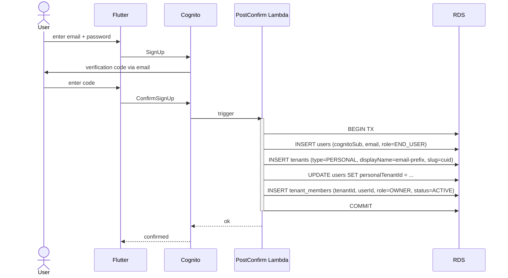
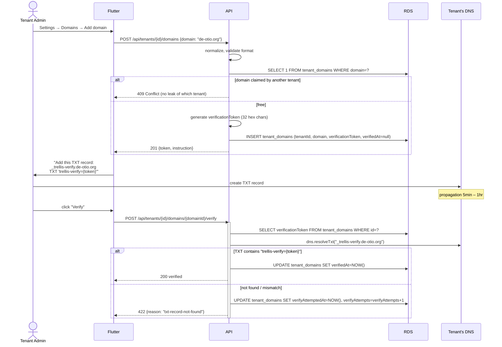
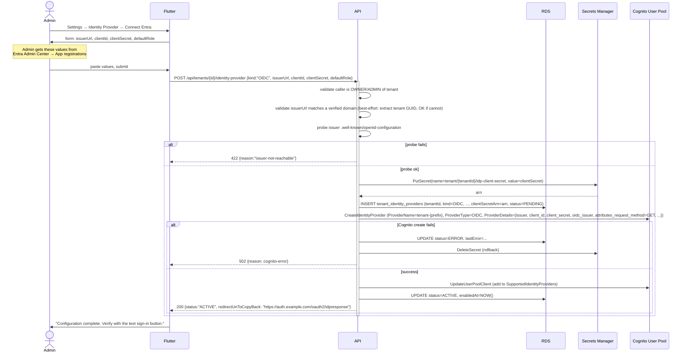
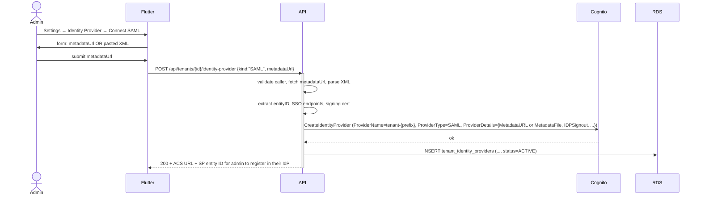

# Onboarding Flows

The five flows that get a tenant from "nothing" to "employees signing in via their corporate IdP." All five must be self-service, automated end-to-end, and have no human in the loop on Trellis's side.

## Overview

| # | Flow | Actor | Outcome |
|---|---|---|---|
| 1 | Consumer sign-up | Anyone with an email | User + personal Tenant created |
| 2 | Organization tenant creation | Authenticated user | New ORGANIZATION Tenant; user becomes OWNER |
| 3 | Domain verification | Tenant ADMIN/OWNER | TenantDomain `verifiedAt` set |
| 4 | IdP connect (OIDC or SAML) | Tenant ADMIN/OWNER | TenantIdentityProvider ACTIVE, Cognito IdP record created |
| 5 | Employee first login (JIT) | Any user via IdP | TenantMember provisioned, JWT issued |

Plus, for non-federated tenants:

| # | Flow | Actor | Outcome |
|---|---|---|---|
| 6 | Email invitation | Tenant ADMIN | Invited user joins on accept |

Plus, for agent-driven setup (the same human flows above, but executed via API by an AI agent on the engineer's behalf):

| # | Flow | Actor | Outcome |
|---|---|---|---|
| 7 | Agent-driven setup | IT engineer's AI agent (e.g. Claude Code) | Same as flows 2–4 + role mappings, but driven via API. Authenticates via OIDC (PKCE + localhost or device authorization grant), not API tokens. See [10-agent-friendly-onboarding.md](./10-agent-friendly-onboarding.md). |

## 1. Consumer sign-up (existing flow, with one addition)

Already designed in [`architecture/05-auth.md`](../architecture/05-auth.md). The change for tenancy: the post-confirmation Lambda creates the user's **personal tenant** in the same transaction that creates the User row.



**Slug for personal tenants:** `personal-{userId}` or just the user's cuid. Personal tenants are not advertised; the slug never appears in URLs (the user uses Trellis as themselves). It exists only so the data model is uniform.

## 2. Organization tenant creation

Self-service. A signed-in user with `User.role = END_USER` clicks "Create organization" from a settings page or hits `POST /api/tenants`.

```mermaid
sequenceDiagram
    actor U as User
    participant Flutter
    participant API as Trellis API
    participant RDS
    participant Cognito

    U->>Flutter: "Create organization"
    Flutter->>U: form: slug + display name
    U->>Flutter: submit slug="de-otio", name="de otio"
    Flutter->>API: POST /api/tenants {slug, displayName}
    activate API
    API->>API: validate slug (regex, length, reserved-list)
    API->>RDS: SELECT 1 FROM tenants WHERE slug=?
    alt slug taken
        API-->>Flutter: 409 Conflict
    else slug free
        API->>RDS: BEGIN TX
        API->>RDS: INSERT tenants (slug, displayName, type=ORGANIZATION, status=ACTIVE)
        API->>RDS: INSERT tenant_members (tenantId, userId, role=OWNER)
        API->>RDS: UPDATE users SET role=B2B_PARTNER WHERE id=? AND role=END_USER
        API->>RDS: COMMIT
        API-->>Flutter: 201 {tenantId, slug}
        Flutter->>API: POST /api/auth/switch-tenant {tenantId}
        API->>Cognito: AdminUpdateUserAttributes (custom:activeTenantId=...)
        API-->>Flutter: ok; client refreshes token
    end
    deactivate API
```

**Slug rules:**

- 3–32 chars
- `[a-z0-9-]+`, no leading/trailing `-`, no `--`
- Reserved list: `admin`, `api`, `app`, `auth`, `console`, `dashboard`, `help`, `mail`, `support`, `www`, `static`, `media`, `cdn`, `oauth`, `sso`, `trellis`, `de-otio`, `system`, etc. — see implementation TODO.
- Globally unique (tenants live in one namespace).

**Why Bump `User.role` to B2B_PARTNER on org creation:** unlocks B2B-only platform features (admin dashboard, billing UI later) without joining through `tenant_members`. Idempotent and safe — END_USER → B2B_PARTNER one-way; we never auto-demote.

**Failure modes to test:**
- Slug collision after passing validation but before commit (race) — the `@unique` constraint catches it; return 409.
- Already a member of an org tenant with the same name — allowed; slug uniqueness is what matters.
- Suspended account creating tenants — denied at auth middleware.

## 3. Domain verification

A tenant claims a domain to (a) enable IdP federation routing on email-domain match, and (b) prove ownership before federation goes live. Industry-standard TXT record.



**Implementation notes:**

- **Token generation:** `crypto.randomBytes(16).toString('hex')`. 128 bits of entropy. Embedded in the record value as `trellis-verify={token}`.
- **DNS lookup:** `node:dns/promises` `resolveTxt`. Fail closed on NXDOMAIN, no records, network error.
- **Caching:** None. DNS itself caches; an explicit re-verify is rare.
- **Re-verification:** A nightly Lambda re-checks `verifyAttemptedAt` is older than 24h or `verifiedAt` is older than 30 days, and revokes domains whose TXT was removed. **Phase 2** — for MVP, once verified is forever-verified until manual removal.
- **Removing a domain:** `DELETE /api/tenants/{id}/domains/{domainId}`. If it's the only verified domain on a tenant with an active IdP, deny (would break sign-in routing); require IdP disable first.
- **Rate limit:** 10 verify attempts per hour per (tenantId, domain). Stops admins from hammering DNS.

**Edge cases:**

- **Apex vs subdomain:** the TXT goes on `_trellis-verify.{domain}`, never on the apex. This avoids TXT collisions with SPF/DKIM/DMARC.
- **Punycode:** internationalized domain names normalized to A-label before storage and lookup.
- **Wildcard / parent-domain claims:** out of scope for MVP. A tenant cannot claim `*.de-otio.org`; they claim each domain explicitly.

## 4. IdP connect (OIDC and SAML)

After at least one verified domain, an admin can attach an IdP. Two paths: OIDC (recommended for Entra) and SAML (for legacy IdPs or admins who prefer it).

### 4a. OIDC connect (Entra recommended path)



Pre-requisites the admin must have done in their IdP (we provide step-by-step in product help):

1. In Entra Admin Center: **App registrations → New registration** named "Trellis".
2. **Redirect URI:** `https://auth.example.com/oauth2/idpresponse` (we provide; same for every tenant — Cognito routes by IdP record).
3. **Certificates & secrets → New client secret.** Copy the value (only shown once).
4. **API permissions:** `openid`, `email`, `profile`, and (for groups) `User.Read` + `GroupMember.Read.All` (or `Group.Read.All` for org-wide read).
5. **Token configuration → Add groups claim** with "Group ID" or "sAMAccountName". This emits a `groups` claim into the ID token.

We collect just the `issuerUrl` (Entra: `https://login.microsoftonline.com/{tenantGuid}/v2.0`), `clientId`, and `clientSecret`.

### 4b. SAML connect



Cognito-supplied values the admin pastes into their SAML IdP:

- **ACS (Reply URL):** `https://auth.example.com/saml2/idpresponse`
- **SP entity ID (audience):** `urn:amazon:cognito:sp:{userPoolId}`

Cognito provides both as part of the `CreateIdentityProvider` response.

### Common to both

- **Attribute mapping** (`attributeMapping` JSON column) is set with sensible defaults: `email → email`, `email → username`, `given_name → given_name`, `family_name → family_name`, `groups → custom:groups`. Tenant admin can edit if their IdP names attributes differently.
- **Default role on JIT** (when no group matches in `TenantRoleMapping`): per-IdP setting; default to `MEMBER` for OIDC with `defaultRole`, deny for SAML unless explicitly set.
- **Disabling the IdP:** `PATCH /api/tenants/{id}/identity-provider {status:"DISABLED"}` calls Cognito `UpdateIdentityProvider` (or `UpdateUserPoolClient` to drop from `SupportedIdentityProviders` — we keep the IdP record itself so future re-enable is fast).

## 5. Employee first login (JIT)

A de otio employee opens the Trellis app. They've never logged in before. They enter `alice@de-otio.org`. From there:

```mermaid
sequenceDiagram
    actor Alice
    participant Flutter
    participant API
    participant Cognito
    participant Entra
    participant PreToken as PreTokenGen Lambda
    participant RDS
    participant DDB as DynamoDB cache

    Alice->>Flutter: enter email "alice@de-otio.org"
    Flutter->>API: POST /api/auth/discover {email}
    API->>RDS: SELECT t.id, idp.cognitoIdpName FROM tenant_domains td JOIN tenants t ON ... JOIN tenant_identity_providers idp ON ... WHERE td.domain="de-otio.org" AND td.verifiedAt IS NOT NULL AND idp.status="ACTIVE"
    API-->>Flutter: 200 {idpRedirect: "/oauth2/authorize?identity_provider=tenant-abc12...&..."}
    Flutter->>Cognito: redirect to /oauth2/authorize?identity_provider=tenant-abc12...
    Cognito->>Entra: redirect (SAML AuthnRequest or OIDC authorize)
    Alice->>Entra: authenticate (existing Entra session, or password+MFA)
    Entra-->>Cognito: SAML response or OIDC token (with email + groups claim)
    Cognito->>Cognito: JIT-create user record in pool with externalProvider=tenant-abc12...
    Cognito->>PreToken: trigger
    activate PreToken
    PreToken->>DDB: GetItem (claims:{cognitoSub})
    alt cache hit & fresh
        DDB-->>PreToken: cached claims
    else miss / stale
        PreToken->>RDS: SELECT user, tenant_membership, role from group claim
        alt User row missing (first login)
            PreToken->>RDS: INSERT users (cognitoSub, email, role=B2B_PARTNER, personalTenant)
            PreToken->>RDS: INSERT personal tenant + member as OWNER
            PreToken->>RDS: SELECT tenant by domain match
            PreToken->>RDS: SELECT tenant_role_mappings WHERE idpGroupName IN (...)
            PreToken->>RDS: INSERT tenant_members (tenantId, userId, role=resolved, isJitProvisioned=true)
        else user exists, evaluate group → role
            PreToken->>RDS: SELECT tenant_role_mappings; resolve role
            PreToken->>RDS: UPSERT tenant_members SET role=resolved, lastActiveAt=NOW()
        end
        PreToken->>DDB: PutItem with TTL=now+3600
    end
    deactivate PreToken
    PreToken-->>Cognito: claims to add: custom:userId, custom:activeTenantId, custom:tenantRole, custom:globalRole
    Cognito-->>Flutter: redirect with code, then ID/access/refresh tokens
    Flutter->>Alice: signed in to de otio tenant
```

See [06-just-in-time-provisioning.md](./06-just-in-time-provisioning.md) for the Lambda code shape.

**Sign-in discovery endpoint:**

```http
POST /api/auth/discover
Content-Type: application/json

{ "email": "alice@de-otio.org" }
```

Response (federated tenant):
```json
{
  "method": "idp",
  "idpRedirect": "https://auth.example.com/oauth2/authorize?identity_provider=tenant-abc12...&response_type=code&client_id=...&redirect_uri=...&scope=openid+email+profile",
  "tenantSlug": "de-otio"
}
```

Response (no matching domain or no IdP):
```json
{ "method": "password" }
```

The endpoint **never** reveals whether the email exists in Cognito — it only reveals whether the email's domain is claimed by a federated tenant. (That's already public information once a tenant claims a domain; our DNS TXT record is public.)

**Edge cases:**

- **User signs in via federation but their Entra account email is not on a verified domain.** Reject the federation attempt (Cognito's pre-authentication trigger or the post-confirmation Lambda fails). We never auto-create a user from an email mismatch.
- **User exists with password auth, then admin enables federation for the user's domain.** On their next sign-in via the IdP redirect, JIT links the federated identity to the existing User row matched by email. Cognito's account-linking via `external_provider` claim handles this if configured.
- **Group claim missing.** Apply IdP's `defaultRole`. If null, deny sign-in.

## 6. Email invitation (non-federated)

For organization tenants without an IdP — typical of small B2B partners (a single café owner). Skip for MVP federation focus, but the schema supports it.

```mermaid
sequenceDiagram
    actor Admin
    participant API
    participant SES as Amazon SES
    actor Invitee

    Admin->>API: POST /api/tenants/{id}/invitations {email, role}
    API->>API: generate signed token (JWT, 7-day exp, claims: tenantId, email, role)
    API->>RDS: INSERT tenant_invitations (token, email, role, expiresAt)
    API->>SES: SendEmail(to=invitee, link=https://example.com/accept?token=...)
    Invitee->>Frontend: click link
    Frontend->>API: GET /api/invitations/{token}
    API->>RDS: SELECT, validate, return display
    Frontend->>Invitee: "Accept invitation to {tenant}?"
    alt invitee not signed up
        Invitee->>Frontend: complete sign-up
        Frontend->>API: POST /api/auth/signup (with invitation token)
        API->>API: create user + personal tenant + accept invitation in one TX
    else invitee signed in
        Invitee->>API: POST /api/invitations/{token}/accept
        API->>RDS: INSERT tenant_members; UPDATE invitations SET acceptedAt=NOW()
    end
```

## Summary

| Flow | Frequency | Touchpoints | Async or sync |
|---|---|---|---|
| Consumer sign-up | High | Cognito + PostConfirm Lambda + RDS | sync (post-confirm) |
| Org tenant creation | Low | API + RDS + Cognito | sync |
| Domain verification | Low | API + DNS + RDS | sync (single DNS lookup) |
| IdP connect | Very low | API + Cognito SDK + Secrets Manager + RDS | sync |
| Employee JIT login | Per session | Cognito + Entra + PreTokenGen Lambda + RDS + DDB | sync (in-trigger) |
| Email invite | Medium | API + SES + RDS | async (email delivery) |

All flows are designed to complete with no human in the loop on Trellis's side. The only blocking step is DNS propagation in flow 3, which is the tenant's responsibility.

## Designed for IT-admin sanity

Per [README §P2 (IT-friendly onboarding for the influential customers)](./README.md#p2-it-friendly-onboarding-for-the-influential-customers), the flows above must feel respectful of how a corporate IT team actually works. Concrete decisions that come from this principle:

### Predictable, fixed endpoints

Every Trellis federation endpoint an IT admin needs to paste into their IdP is the **same string for every tenant**, documented and stable:

| Value | Constant |
|---|---|
| OIDC redirect URI | `https://auth.example.com/oauth2/idpresponse` |
| SAML ACS / Reply URL | `https://auth.example.com/saml2/idpresponse` |
| SAML SP Entity ID | `urn:amazon:cognito:sp:{userPoolId}` (one user pool, one entity ID) |
| Domain verification record | `_trellis-verify.{their-domain}` TXT |
| SCIM endpoint (Phase 2) | `https://api.example.com/scim/v2` |

The admin never has to ask Trellis for "your tenant-specific URL." Cognito routes by IdP record + IdpIdentifiers (the verified domain list).

### Standard claim names only

Trellis's default attribute mapping uses **standard OIDC and SAML claim names**:

- `email`, `email_verified`
- `given_name`, `family_name`
- `groups` (OIDC) / `http://schemas.microsoft.com/ws/2008/06/identity/claims/groups` (SAML)

We don't ask the customer to add a custom claim called `trellis_role` or similar. Their existing IdP setup likely has these claims already; if not, adding `email` and `groups` is a 5-minute setting in any modern IdP.

If a customer's IdP emits non-standard claim names, the **per-tenant `attributeMapping` JSON** lets them remap without us touching code.

### Test-before-enforce

The "Settings → Identity Provider → Test Sign-in" button performs a full federation flow with the admin's own account and surfaces:

- Raw claims received from the IdP
- Resolved tenant role (so they can validate their `TenantRoleMapping` is correct)
- Group identifiers extracted (so they know whether their IdP emits group object IDs or display names)

This is the diagnostic an admin needs *before* flipping federation live for the org. Without it, the first failure would be "we enabled SSO and 50 employees can't log in" — exactly the experience that turns IT against a vendor.

### IT operations they can run themselves

Without a support ticket:

- **Rotate IdP client secret.** Admin updates secret in their IdP, pastes the new value in Trellis, hits Save. Old version is retained in Secrets Manager for 7-day rollback.
- **Force-revoke a user's session.** "Remove member" calls `AdminUserGlobalSignOut`; effective within seconds.
- **Disable IdP without deleting it.** Toggle `status` to `DISABLED`; Cognito stops routing to it but config is retained for re-enable.
- **Export audit log.** `GET /api/tenants/{id}/audit?from=...&to=...&format=csv`.
- **See subprocessor list.** Settings page, machine-generated from current configuration.

### Per-IdP setup walkthroughs (docs deliverable)

In `doc/01-business/features/internal-features/onboarding/`, we ship per-IdP walkthroughs.

**MVP scope: Entra OIDC only.**

- `entra-oidc-setup.md` — exact app-registration steps, screenshots, group-claim configuration. Drafted alongside the Stage 10 de otio dogfood.

**Phase 2 (added when each IdP gets its first customer):**

- `entra-saml-setup.md` — alternative protocol on the same IdP
- `okta-setup.md`
- `google-workspace-setup.md`
- `auth0-setup.md`

The MVP walkthrough is the only one tested end-to-end. An IT admin following `entra-oidc-setup.md` should be able to onboard de otio (and any future Entra customer) in under an hour.

### What an IT admin *doesn't* have to learn

We deliberately *don't* expose:

- Cognito IdP-record names (we generate them; the admin sees friendly names)
- Cognito user pool ID (the SP Entity ID is opaque from their perspective)
- Trellis's own internal model of capabilities (they see "ADMIN/MEMBER/GUEST" roles, not the underlying `entity.update`-style capabilities)

The admin's mental model is "domain → IdP → group → role." Anything they don't strictly need is hidden by default but accessible behind an "Advanced" disclosure.

### Self-service for offboarding too

Just as critical as onboarding: an admin who decided to leave Trellis must be able to **disconnect their IdP, export their audit log, and request tenant deletion** without involving Trellis's team. The first two are MVP. Tenant deletion is Phase 3, but the *request-and-confirmation flow* exists in MVP — it queues the action for execution rather than requiring email-to-support.
