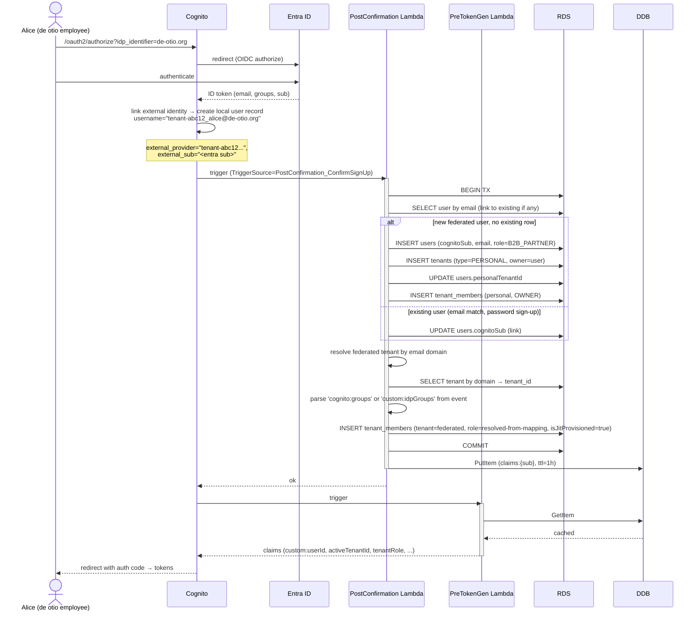

# Just-in-Time Provisioning

How a Trellis `User` and `TenantMember` row appear automatically the first time a federated user authenticates. Plus deprovisioning, edge cases, and the deferred SCIM design.

## The path

Federated user → Cognito → IdP → Cognito post-confirmation hand-off → pre-token-gen Lambda → RDS. The first-login moment is the only time a User and TenantMember row are created via JIT; subsequent logins refresh state.



## Two triggers, two responsibilities

Cognito Lambda triggers fire in a specific sequence. We use two:

| Trigger | When | What we do |
|---|---|---|
| **PostConfirmation** | After Cognito has accepted the user (post-signup or post-federated-confirm) | One-shot: create User + personal Tenant + TenantMember (JIT). Idempotent. |
| **PreTokenGeneration** | On every token issuance and refresh | Read or refresh claims from DDB cache, fall back to RDS, write to JWT. |

The PostConfirmation trigger fires **once per Cognito user record per pool** — the first time a federated identity authenticates, Cognito creates a local user record in the pool and fires this trigger. Subsequent logins skip it. That's why it's the right place to do the heavy provisioning work.

## PostConfirmation Lambda (sketch)

```typescript
// trellis: apps/api/src/lambda/post-confirmation.ts
import { CognitoUserPoolTriggerHandler } from 'aws-lambda';

export const handler: CognitoUserPoolTriggerHandler = async (event) => {
  const sub        = event.userName;
  const userAttrs  = event.request.userAttributes;
  const email      = userAttrs.email?.toLowerCase();
  const isFederated = !!userAttrs['identities'];
  const idpGroups   = (userAttrs['custom:idpGroups'] ?? '').split(',').filter(Boolean);

  if (!email) {
    console.error('post-confirm: no email; skipping');
    return event;
  }

  await db.$transaction(async (tx) => {
    // 1. Upsert User
    let user = await tx.user.findFirst({ where: { email } });
    if (!user) {
      user = await tx.user.create({
        data: {
          email,
          cognitoSub: sub,
          role: isFederated ? 'B2B_PARTNER' : 'END_USER',
          handle: deriveHandle(email),
        },
      });
    } else if (!user.cognitoSub) {
      // Existing email, never logged in via Cognito — link the identity
      user = await tx.user.update({ where: { id: user.id }, data: { cognitoSub: sub } });
    }

    // 2. Ensure personal tenant
    if (!user.personalTenantId) {
      const personalTenant = await tx.tenant.create({
        data: {
          slug: `personal-${user.id}`,
          displayName: user.handle,
          type: 'PERSONAL',
          personalOwnerUserId: user.id,
          members: { create: { userId: user.id, role: 'OWNER', status: 'ACTIVE' } },
        },
      });
      await tx.user.update({
        where: { id: user.id },
        data: { personalTenantId: personalTenant.id },
      });
    }

    // 3. Federated path: resolve tenant by domain, JIT-provision membership
    if (isFederated) {
      const domain = email.split('@')[1];
      const tenantDomain = await tx.tenantDomain.findUnique({
        where: { domain },
        include: { tenant: { include: { identityProvider: true, roleMappings: true } } },
      });
      if (!tenantDomain || !tenantDomain.verifiedAt) {
        // Federated login but no matching verified domain — abort the JIT
        // for the org tenant. The personal tenant + user still exists.
        console.warn(`federated user ${email} has no verified domain match`);
        return;
      }
      const tenant = tenantDomain.tenant;
      if (!tenant.identityProvider || tenant.identityProvider.status !== 'ACTIVE') {
        console.warn(`federated user ${email}: tenant ${tenant.slug} has no active IdP`);
        return;
      }

      const tenantRole = resolveRole(idpGroups, tenant.roleMappings, /* defaultRole */ 'MEMBER');
      if (!tenantRole) {
        console.warn(`federated user ${email}: no matching role; denying`);
        // Don't insert TenantMember. The user gets a pre-token-gen "no active tenant"
        // claim and the API returns 403 to all tenant-scoped endpoints.
        return;
      }

      await tx.tenantMember.upsert({
        where: { tenantId_userId: { tenantId: tenant.id, userId: user.id } },
        create: {
          tenantId: tenant.id,
          userId: user.id,
          role: tenantRole,
          status: 'ACTIVE',
          joinedAt: new Date(),
          isJitProvisioned: true,
        },
        update: {
          role: tenantRole,           // refresh from groups
          status: 'ACTIVE',
          lastActiveAt: new Date(),
        },
      });
    }
  });

  return event;
};
```

The transaction is critical: half-created users are worse than no users. If the transaction fails, the trigger throws, Cognito treats the confirmation as failed, and the user sees an error rather than a half-provisioned state.

## PreTokenGen Lambda — minimal version

```typescript
// trellis: apps/api/src/lambda/pre-token-generation.ts
import { CognitoUserPoolTriggerHandler } from 'aws-lambda';

export const handler: CognitoUserPoolTriggerHandler = async (event) => {
  const sub = event.userName;

  let claims = await dynamoCache.get(sub);
  if (!claims) {
    claims = await loadClaimsFromRds(sub);
    await dynamoCache.put(sub, claims, 3600);
  }

  // Re-resolve role on every issuance — group claim may have changed
  const idpGroupsRaw = event.request.userAttributes['custom:idpGroups'];
  if (idpGroupsRaw && claims.activeTenantId) {
    const idpGroups = idpGroupsRaw.split(',').filter(Boolean);
    const refreshed = await maybeRefreshRole(claims.userId, claims.activeTenantId, idpGroups);
    if (refreshed) {
      claims.tenantRole = refreshed;
      await dynamoCache.put(sub, claims, 3600);
    }
  }

  event.response = {
    claimsOverrideDetails: {
      claimsToAddOrOverride: {
        'custom:userId':         claims.userId,
        'custom:globalRole':     claims.globalRole,
        'custom:activeTenantId': claims.activeTenantId ?? '',
        'custom:tenantSlug':     claims.tenantSlug ?? '',
        'custom:tenantRole':     claims.tenantRole ?? '',
        'custom:handle':         claims.handle,
      },
    },
  };
  return event;
};
```

`maybeRefreshRole` is a fast read-only path — query `TenantRoleMapping`, compare against current `tenant_members.role`, update if changed. This catches the case where a tenant admin changes the role mapping while a user has a valid token; on the user's next refresh (<= 1h), the role updates without requiring sign-out.

## Active-tenant default for federated users

When a federated user signs in for the first time, what's their active tenant? Two valid choices:

- **Federated tenant** (default) — they came in via the IdP redirect, they're clearly here for org work.
- **Personal tenant** (alternative) — keep B2B and B2C contexts visibly separate from sign-in 1.

We pick **federated tenant**: the activate is what they see by default, with an obvious tenant-switcher dropdown to flip to their personal tenant. This matches Atlassian/Slack/Notion intuition.

## Account linking

If a user signed up with a password (creating a `User` row + personal tenant), then later their employer connects an IdP for that domain, the user can log in via the IdP. Cognito's account-linking via the email attribute handles the federated identity → existing pool user link. Our PostConfirmation logic then links the federated identity in our `User` table by matching email.

We do **not** automatically delete or migrate the password-auth path. Both paths coexist for that user until:

- The tenant admin enforces "federated only" (Phase 3 setting), or
- The user manually disables password auth in their settings.

For MVP, the user can use either method. We document that mixing both reduces security guarantees (the tenant's MFA enforcement only applies to federated path).

## Deprovisioning

### Tenant admin removes a member

```http
DELETE /api/tenants/{tenantId}/members/{memberId}
```

Effects (in one transaction):
- `tenant_members.status = 'REMOVED'`, `removedAt = NOW()`.
- DDB cache invalidated for that user's `cognitoSub`.
- API call to `AdminUserGlobalSignOut` for the user — revokes all their existing tokens.

The user's `User` row, personal tenant, and other tenant memberships are untouched. They simply lose access to the federated tenant.

### IdP-side group removal

If an Entra admin removes a user from `Trellis-Admins` (so their groups now match `Trellis-Members`), the next token refresh re-resolves their role via `maybeRefreshRole`. The user gracefully demotes from ADMIN to MEMBER.

If the user is removed from *all* mapped groups, they fall through to `defaultRole`. If `defaultRole` is null, they're effectively denied — the pre-token-gen Lambda returns a sentinel "no active tenant" claim and every tenant-scoped endpoint returns 403. **Phase 2:** we want a Lambda that periodically polls for "user removed from all groups" and flips `tenant_members.status = REMOVED` so they don't sit in zombie state.

### IdP-side user disable

When the tenant disables a user in their IdP, the IdP no longer issues tokens to Cognito. Existing Cognito tokens remain valid until expiry. We rely on:

- **Short access-token TTL** (1 hour) so disabled users lose access quickly.
- **Refresh-token revocation:** when the IdP returns an authentication error, Cognito's session for that federated user expires. Refresh fails. The user is de facto signed out.
- **Phase 2 SCIM** for proactive deprovisioning (see below).

### Tenant disconnect of IdP

When a tenant disables their IdP (`status = DISABLED`):
- All federated members of that tenant lose sign-in capability.
- Existing tokens valid until expiry.
- We do **not** delete `tenant_members` rows — the admin may re-enable the IdP. Membership is preserved as the source of truth.
- We **do** call `AdminUserGlobalSignOut` for all active federated members of that tenant — proactive sign-out.

## SCIM (Phase 2)

System for Cross-domain Identity Management — the standard for IdP-driven user lifecycle. Two endpoints we'd implement:

```
POST   /scim/v2/Users          → JIT-provision a user (analogous to first federated login)
GET    /scim/v2/Users          → list users in the tenant
GET    /scim/v2/Users/{id}     → get user
PATCH  /scim/v2/Users/{id}     → update attributes (active, displayName, groups)
DELETE /scim/v2/Users/{id}     → deprovision (sets status=REMOVED)

POST   /scim/v2/Groups         → upsert group → role mapping
GET    /scim/v2/Groups
PATCH  /scim/v2/Groups/{id}    → modify membership
```

What SCIM gives us that JIT alone doesn't:

| Capability | JIT alone | JIT + SCIM |
|---|---|---|
| User created on first login | ✅ | ✅ |
| User deprovisioned within minutes of IdP-side disable | ❌ (waits for token expiry) | ✅ (Entra calls DELETE) |
| Group membership reflected before login | ❌ | ✅ |
| Pre-create users so a "Welcome" email arrives before they log in | ❌ | ✅ |

**Why deferred to Phase 2:**

- SCIM 2.0 spec compliance is significant work (RFC 7643/7644). PATCH operations alone are non-trivial.
- Atlassian gates SCIM behind Atlassian Guard — they did the math on cost vs value. We don't have to charge for it, but we don't have to build it on day 1 either.
- For de otio's MVP: 5 employees, JIT + manual offboarding via `DELETE /api/tenants/{id}/members/{id}` is sufficient.

**Authentication for SCIM:** bearer token, scoped to the tenant. Generated once per tenant when admin enables SCIM, stored in Secrets Manager, regenerable. Token rotation is admin-initiated.

**Endpoint hosting:** part of the trellis API, mounted at `/scim/v2`. Requires its own request schema validation (SCIM has a specific content-type and error format).

## Edge cases

| Scenario | Behavior |
|---|---|
| Federated user, but email not on any verified domain | PostConfirmation logs a warning, creates User + personal tenant only. They can use Trellis as a B2C user but not as a member of any org. |
| Federated user, multiple matching verified domains across tenants (collision) | Should be impossible: domains are unique across all tenants. If somehow seen, log error, refuse the JIT, alert. |
| User changes email in IdP | New email surfaces in next token. We update `users.email` in PreTokenGen. If the new email is on a different verified-domain tenant, we don't auto-move membership; that requires admin action. |
| Pool user exists but RDS user row missing (drift after RDS restore) | PreTokenGen logs the drift, returns minimal claims (no userId, no tenantId). All API calls 403. Admin must manually reconcile. |
| Group claim format the IdP emits is unrecognized | Best-effort split on comma/semicolon/space. If we still can't parse, return defaultRole. Audit log entry created. |
| User has been REMOVED from tenant but their token is still valid | Pre-token-gen on next refresh: `tenant_members.status != ACTIVE` → return empty `activeTenantId`. API endpoints check the claim and 403. |

## Idempotency requirements

The PostConfirmation Lambda **must** be safely retriable:

- All upserts (`upsert`, `findFirst+create`) instead of blind inserts.
- Unique constraints (`@@unique([tenantId, userId])`) catch any double-creation race.
- Cache writes are last-write-wins by design.

Cognito retries failed triggers up to 3 times with backoff. If the trigger keeps failing after 3 retries, the user's confirmation completes but with an inconsistent state. We rely on:

1. The transaction in PostConfirmation succeeds atomically or fails entirely.
2. PreTokenGen's RDS fallback — if PostConfirmation never landed, PreTokenGen runs `loadOrCreateClaimsFromRds(sub)` on the next token request, which performs the same provisioning logic. It's a safety net, not the primary path.

## Testing

Two test surfaces:

- **Unit tests** for `resolveRole`, `loadClaimsFromRds`, the role grants matrix.
- **Integration tests** for the Lambda flow against a local Cognito-emulator + Postgres. Cognito Local supports user pool triggers; we can drive PostConfirmation events with synthetic federated payloads (mocking the `identities` and `custom:idpGroups` attributes).

E2E with real Entra: dogfood. de otio's first sign-in *is* the integration test.
