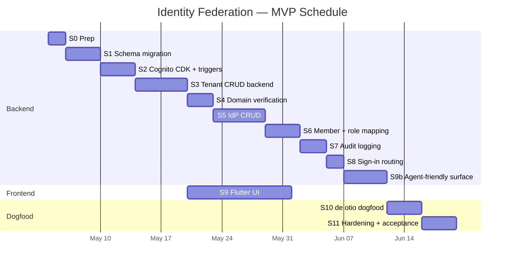

# Implementation Plan

Work breakdown, sequencing, and risks for shipping identity federation in the MVP timeline. Companion to [08-mvp-scope.md](./08-mvp-scope.md) (what) — this doc covers when and in what order.

> **Perspective.** Stages 1–8 + 9b are **trellis-side** work shipped in the v0.7 release. Stage 9 (Flutter UI) and Stage 10 (de otio dogfood) are **trellis-side** work consuming that release. The two halves run mostly in parallel after the schema migration lands.

## Estimate

**~6–8 weeks** of focused single-developer work, assuming no surprises in Cognito + Entra federation and the agent-friendly surface (Stage 9b) lands cleanly. Stretched to **~10 weeks** with normal interruptions and dogfood iteration.

This is the trellis-side build needed before the first consuming product (Trellis) can adopt the framework features. Trellis's product-side timeline (Flutter UI, CDK additions, dogfood) is in `trellis/doc/02-technical/architecture/identity-federation-adoption.md` and rolls up to its own MVP plan; the two run mostly in parallel after the schema migration lands.

## Work breakdown

### Stage 0 — Prep (1–2 days)

- [ ] Create AWS Secrets Manager prefix `tenant/*` IAM policy for trellis task role (CDK).
- [ ] Bump Cognito `UserFederation` quota to 100 RPS in dev region (one-time AWS request, lead time ~2 days).
- [ ] Reserve test Entra tenant for dev (de otio team — request from IT or use a Microsoft 365 free dev tenant).
- [ ] Document Entra app-registration steps in `doc/01-business/features/internal-features/onboarding/entra-setup.md` (for tenant admins reading our docs later).

### Stage 1 — Schema migration (3–5 days)

- [ ] Author Prisma migration `add_tenancy_model` ([02-data-model.md](./02-data-model.md) §migration-strategy).
  - Drops `Partner` and `User.partnerId`.
  - Adds 6 new tables.
  - Adds non-nullable `tenant_id` columns to ~10 existing tables.
- [ ] Update Prisma client; regenerate; address compile errors in trellis.
- [ ] Update existing seed/dev fixtures so any seeded data carries valid `tenantId`.
- [ ] Run migration in dev; verify Postgres state.
- [ ] Smoke-test API still boots.

**Dependency:** schema must land before Cognito triggers can store tenant IDs in JWT — and before any handler can query tenant-scoped tables. This is a critical-path bottleneck and must merge clean.

**Risk:** breaks all existing tests until handlers are updated. Land in a single PR with handler updates so dev environment stays green; this is the largest single PR of the project.

### Stage 2 — Cognito CDK + base triggers (3–5 days)

- [ ] Add custom attributes to user pool (`activeTenantId`, `tenantRole`, `tenantSlug`).
- [ ] Add Lambda functions: `postConfirmFn` (rewrite), `preTokenGenFn` (rewrite).
- [ ] Wire triggers; CDK diff and deploy to dev.
- [ ] Lambda cold-path: stub responses just to verify wiring before real logic.
- [ ] Set up DynamoDB single-table cache prefix for `claims:*`. Already exists (`{stage}-trellis` table); document the new key shape.

### Stage 3 — Tenant CRUD backend (5–7 days)

- [ ] `POST /api/tenants` (create organization tenant).
- [ ] `GET /api/tenants/{id}` and `GET /api/users/me/tenants` (list).
- [ ] `PATCH /api/tenants/{id}` (update display name; slug changes Phase 2).
- [ ] `POST /api/auth/switch-tenant`.
- [ ] PostConfirmation Lambda — full implementation: create User + personal Tenant + TenantMember.
- [ ] PreTokenGen Lambda — DynamoDB cache + RDS fallback + claim writeback.
- [ ] AuthMiddleware reads new claims into `AuthContext`.
- [ ] Handlers updated to call `requireCapability(...)` where needed.
- [ ] **All existing handlers audited and updated** to include `tenantId` in Prisma queries. Largest sub-task; ~30+ handlers.

### Stage 4 — Domain verification (2–3 days)

- [ ] `POST/GET/DELETE /api/tenants/{id}/domains`.
- [ ] `POST /api/tenants/{id}/domains/{domainId}/verify` with `dns.resolveTxt`.
- [ ] Token generation, validation logic, rate-limiting.
- [ ] Tests covering happy path + 6 edge cases.

### Stage 5 — IdP CRUD (Entra OIDC; 4–5 days)

MVP scope is **Entra via OIDC only**; SAML branch is stubbed for symmetry but not validated end-to-end (Phase 2).

- [ ] `POST /api/tenants/{id}/identity-provider` — OIDC branch fully implemented and tested with Entra.
- [ ] OIDC issuer-probe before commit.
- [ ] Secrets Manager secret create (with rollback on Cognito failure).
- [ ] `CreateIdentityProviderCommand` integration; map to Cognito's `ProviderDetails` for OIDC.
- [ ] App-client `SupportedIdentityProviders` update via `UpdateUserPoolClientCommand`.
- [ ] `PATCH` (rotate secret, change attribute mapping, change defaultRole).
- [ ] `PATCH` for status (DISABLED/ACTIVE).
- [ ] `DELETE` (with confirm-with-MFA flag for Phase 2; MVP just returns 200).
- [ ] Tests against `aws-sdk-client-mock` for the Cognito SDK.
- [ ] SAML branch: skeleton handler present, returns 501 Not Implemented in MVP, no Flutter UI.

### Stage 6 — Member management + Role mapping (3–4 days)

- [ ] `GET /api/tenants/{id}/members`.
- [ ] `PATCH /api/tenants/{id}/members/{memberId}` (role change).
- [ ] `DELETE /api/tenants/{id}/members/{memberId}` (with `AdminUserGlobalSignOut`).
- [ ] `POST /api/tenants/{id}/transfer-ownership`.
- [ ] `GET/POST/PATCH/DELETE /api/tenants/{id}/role-mappings`.
- [ ] Pre-token-gen role refresh path (consult `TenantRoleMapping` against current group claims, update if changed).
- [ ] Cache-invalidation on every change.

### Stage 7 — Audit logging (2–3 days)

- [ ] `audit-event-emitter.ts` helper writes to CloudWatch + Postgres in one call.
- [ ] All admin actions instrumented (list in [07-security-and-isolation.md](./07-security-and-isolation.md)).
- [ ] `GET /api/tenants/{id}/audit` endpoint.
- [ ] CloudWatch log group `/{stage}/audit-events` with 30-day retention.

### Stage 8 — Sign-in routing endpoint (1–2 days)

- [ ] `POST /api/auth/discover` — DB lookup, returns IdP redirect URL or password fallback.
- [ ] Rate-limit per source IP (anti-enumeration).
- [ ] Tests for federated, non-federated, multi-domain tenant cases.

### Stage 9 — Flutter integration (10–14 days, **mostly parallelizable with stages 4–8**)

This is the biggest UI workstream. Can begin once stage 3 is merged and the API surface is stable.

- [ ] **Sign-in screen** — email-first; calls `/api/auth/discover`; either shows password form or kicks off Cognito hosted UI flow with `idp_identifier`.
- [ ] **Cognito hosted UI invocation** — `flutter_appauth` or similar, opens `SFAuthenticationSession` / Custom Tabs.
- [ ] **Token refresh wiring** — Amplify `Auth` plugin with the user-pool client.
- [ ] **Tenant switcher dropdown** in app bar.
- [ ] **Settings page tree:**
  - Organization → Members (list + invite/remove/role-change)
  - Organization → Domains (add/verify/remove)
  - Organization → Identity Provider (**Entra OIDC** connect/configure/test/disable; other IdPs hidden in MVP)
  - Organization → Role Mappings (CRUD with group-name typeahead)
- [ ] **Org wizard** — "Create organization" multi-step flow.
- [ ] **Test sign-in button** — performs an OAuth flow against the configured IdP, captures the `groups` claim, displays in role-mapping UI.

### Stage 9b — Agent-friendly surface (4–6 days, parallelizable with S9)

Per [10-agent-friendly-onboarding.md](./10-agent-friendly-onboarding.md) and [11-agent-friendly-compliance.md](./11-agent-friendly-compliance.md). Builds on the API endpoints already shipped in S3–S8; this stage adds the discovery + agent-auth + compliance surfaces.

- [ ] **Discovery files** — `/llms.txt`, `/security.txt`, `/.well-known/compliance.json`, `/.well-known/compliance.md`, `/.well-known/compliance.schema.json`, `subprocessors.json`. Initial content authored from existing design docs; served by static-site stack (CloudFront + S3).
- [ ] **OpenAPI generation** — pipeline that emits `openapi.json` from trellis Zod schemas + route metadata. Served at `https://api.example.com/openapi.json`. CI fails if any route lacks a schema.
- [ ] **`GET /api/tenants/{id}/setup-status`** endpoint with documented shape; populated from existing tenant + domain + IdP + role-mapping queries.
- [ ] **`GET /api/tenants/{id}/compliance.json`** endpoint returning baseline + tenant overrides.
- [ ] **`Idempotency-Key` middleware** for federation POSTs; DynamoDB-backed dedup window 24h.
- [ ] **Structured-error response shape** standardized across federation routes.
- [ ] **Cognito agent app client** (`trellis-agent-cli`) added in CDK: public, PKCE-required, `127.0.0.1` redirects, restricted scopes.
- [ ] **Device-authorization adapter** — trellis routes for `POST /oauth2/device_authorization`, `GET /agents/authorize`, `POST /oauth2/token` (device-code grant). DynamoDB stores in-flight device codes with TTL.
- [ ] **`/settings/agents`** Flutter UI — list sessions, revoke.
- [ ] **Refresh-token reuse detection** — implement single-use refresh + revocation cascade.
- [ ] **CI lint for `compliance.json`** — schema validation + deny-list of marketing terms.
- [ ] **End-to-end agent fixture** — recorded Claude Code transcript driving full onboarding against dev.

### Stage 10 — End-to-end de otio dogfood (3–5 days)

- [ ] Create real Trellis `de-otio` tenant in dev environment.
- [ ] de otio IT verifies `de-otio.org` TXT record.
- [ ] Real Entra app registration; OIDC config pasted into Trellis.
- [ ] Define Entra groups (`Trellis-Admins`, `Trellis-Members`) and assign them to test users.
- [ ] First sign-in by Richard (presumably an admin) — verify role resolution, token claims, capability gates.
- [ ] Second sign-in by another de otio employee — verify member-role.
- [ ] **Dogfood the agent path:** Richard runs the entire setup flow above through Claude Code (driving the canonical agent transcript end-to-end against a fresh dev tenant). Captures friction; goes back to refine `llms.txt` and walkthrough docs based on observed agent confusion points.
- [ ] **Dogfood the compliance path:** ask Claude Code "does Trellis meet de otio's compliance requirements?" using only the published `compliance.json`. Verify the answer is correct and complete.
- [ ] Iterate on UI/flow rough edges discovered during dogfood.
- [ ] Promote dev → staging → prod once stable in dev.

### Stage 11 — Hardening + Phase 1 acceptance criteria (3–5 days)

- [ ] All cross-tenant isolation tests written and passing.
- [ ] Load test — pre-token-gen Lambda at 100 RPS sustained for 10 minutes.
- [ ] Documentation pass: tenant-admin help docs, IdP-setup walkthroughs (Entra OIDC, Entra SAML, Okta as bonus).
- [ ] Audit log review: all expected events fire; nothing sensitive leaks into log payloads.
- [ ] Security review per [07-security-and-isolation.md](./07-security-and-isolation.md) §must-haves checklist.
- [ ] Smoke test in prod with real-but-disposable tenant.

## Sequencing diagram

Total elapsed weeks (with parallel UI work): ~7–9 weeks single-developer.

## Critical-path identification

| If this slips… | …everything downstream slips |
|---|---|
| **S1 schema migration** | All other backend stages |
| **S2 Cognito triggers wired** | S3 cannot validate end-to-end |
| **S5 IdP CRUD** | S10 dogfood blocked |
| **S6 role mapping** | de otio role-resolution can't be tested |
| **S10 dogfood** | Production rollout blocked |

Non-critical-path:
- S7 audit logging — useful but not blocking sign-in
- S4 domain verification before S5 — verified domain is *required* for IdP connect (we enforce); but the dev flow can manually set `verifiedAt = now()` for test tenants
- S9 Flutter UI — entire backend is testable via curl; ship Flutter in pass 2 if frontend timeline is uncertain

## Risk register

| # | Risk | Likelihood | Impact | Mitigation |
|---|---|---|---|---|
| R1 | Entra OIDC client-credential setup fails in unforeseen ways | Medium | High | Allocate a half-day for pair-debugging with an Entra-experienced engineer; Microsoft's tutorial is detailed; if OIDC proves intractable in time, the dormant SAML branch can be unlocked as a fallback (Phase-2 work pulled forward — adds ~3 days but viable) |
| R2 | Schema migration breaks dev environment for > 1 day | Low | Medium | Single PR with all handler updates; thorough local test before merge; revertable in one PR |
| R3 | Pre-token-gen Lambda timeouts at scale | Low | High | DynamoDB cache + RDS Proxy + reserved concurrency 50; load-test before dogfood |
| R4 | Existing handlers leak across tenants after audit pass | Medium | Critical | Test fixture with two seeded tenants; every test asserts cross-tenant 404 |
| R5 | Hosted UI redirect issues on iOS (Cognito's prebuilt UI vs `SFAuthenticationSession`) | Medium | Medium | Use Amplify Auth which handles the session-detection edge cases; fall back to manual `flutter_appauth` if Amplify proves janky |
| R6 | Cognito IdP record corruption mid-config | Low | Medium | Postgres holds all metadata; can `DELETE` + `CREATE` the Cognito IdP record idempotently |
| R7 | Cognito 300-IdP default quota hit | Very low for MVP | Medium | Architecture supports 1,000; quota increase request is a 2-day AWS turnaround. Not an MVP risk. |
| R8 | Schema invalidates existing E2E tests; CI red for days | Low | Medium | Land schema + test updates in same PR |
| R9 | Two parallel admins racing on IdP CRUD cause inconsistent state | Low | Low | DB transactions + Cognito's eventual consistency tolerated; treat as "last-write-wins" |
| R10 | de otio Entra admin too busy to do app registration on schedule | Medium | High | Schedule kick-off meeting end of S5; provide clear written walkthrough; have a fallback test Entra tenant we control |

## Out-of-band setup the user must do

- **AWS:** request Cognito quota bumps (`UserFederation` to 100 RPS, IdPs/pool to 500 if approaching 250).
- **Entra (de otio side):** create the Trellis app registration + client secret + groups claim + admin consent for `GroupMember.Read.All`. Allocate ~30 min of an Entra-admin's time.
- **DNS (de otio side):** add the TXT record for `_trellis-verify.de-otio.org`. Allocate ~5 min of someone with DNS access.
- **TLS cert:** `auth.example.com` ACM cert. Already exists for the base Cognito hosted-UI domain; verify covers the auth subdomain.

## Rollback plan

If federation breaks in production:

1. **Disable affected tenant's IdP** via `PATCH /api/tenants/{id}/identity-provider {status: "DISABLED"}`. Federated members lose sign-in; admins can sign in via password (if they have one) or via account-recovery.
2. **Roll back Lambda** versions if PreTokenGen is the culprit (CDK supports versioned Lambda aliases).
3. **In extremis,** add an environment flag `FEDERATION_DISABLED=true` that PreTokenGen reads to fall back to the pre-federation claims shape; B2C functionality continues, B2B is degraded but not down. Worth implementing as a safety net.
4. **Hotfix and redeploy.** No data loss because tenant data isn't entangled with federation state — disabling the IdP doesn't drop members.

## Open implementation questions

| # | Question | Owner | When to answer |
|---|---|---|---|
| Q1 | Is Amplify Auth Flutter SDK fast-enough-and-modern-enough for our needs, or do we use `flutter_appauth` directly? | Richard | S2 — needs to be decided before S9 wiring begins |
| Q2 | Does the existing CDK auth stack support custom attribute additions without recreating the user pool? | Richard | S2 — verify before changing Cognito CDK |
| Q3 | What's the slug-reservation list? Need a comprehensive seed list before letting users create tenants | Richard | S3 — before `POST /api/tenants` ships |
| Q4 | ~~OIDC vs SAML default for de otio~~ | **Resolved** | MVP is OIDC-only for Entra; SAML deferred to Phase 2 |
| Q5 | Does Entra emit group object IDs as GUID strings or display names by default? Verify against a real Entra config | Richard | S10 — first-real-test phase |
| Q6 | Audit log: ship a dedicated CloudWatch log group, or fold into existing `/trellis/{stage}/api`? | Richard | S7 — no urgent answer, default to dedicated |

## Success metrics post-launch

After the dogfood completes and we declare federation "live for real":

- **Federated sign-in success rate** ≥ 99% over 7 days.
- **PreTokenGen p95 latency** < 200ms with cache, < 1s without.
- **Zero cross-tenant data exposure incidents** in the first 90 days.
- **First non-de-otio tenant created and federates successfully** within 60 days.
- **Tenant onboarding time** (signup → first federated login by an employee) < 1 hour 90% of the time.
