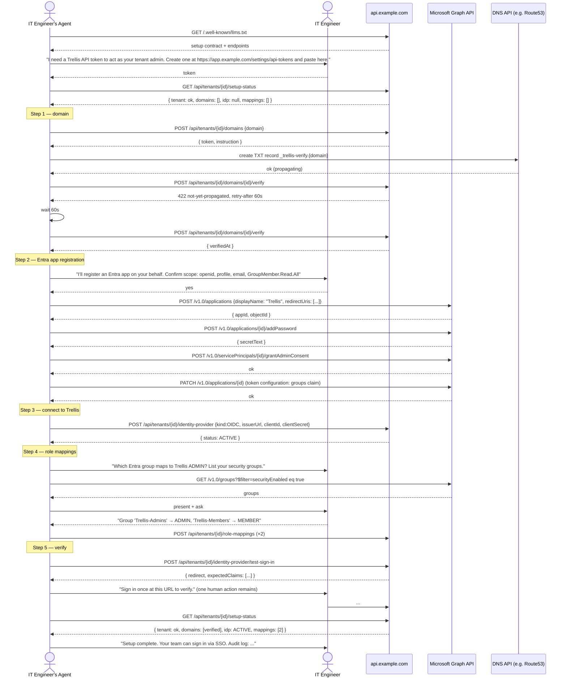

# Agent-Friendly Onboarding

How a customer's IT engineer can hand setup to an AI agent (Claude Code, etc.) and get to "Trellis is configured for our company" with minimal hand-holding.

## The persona scenario

> _"Help me setup Trellis for my company."_
> — IT engineer @ a customer org, talking to Claude Code

The agent should be able to:

1. Discover what Trellis is and what setup involves.
2. Ask the engineer for the few inputs only a human can supply (Entra tenant admin consent, business decisions about role mappings).
3. Drive every other step via API or via tools the agent already has (Microsoft Graph, Route53/Cloudflare, etc.).
4. Verify the result.
5. Hand the engineer back a working tenant with a one-paragraph summary.

This isn't a "nice-to-have." Per [README §P2 (IT-friendly onboarding for the influential customers)](./README.md#p2-it-friendly-onboarding-for-the-influential-customers), internal IT is the gatekeeper for B2B adoption — and internal IT is increasingly using AI agents as a force multiplier. **Trellis's onboarding surface is, in effect, an agent integration surface.** Designing for it specifically is what unlocks the "5–10 paying B2B partners" milestone.

## Design principles for agent-friendliness

| # | Principle | What it means | Concrete consequence |
|---|---|---|---|
| A1 | **Discoverable** | An agent at a fresh prompt should find Trellis's setup contract via standard mechanisms. | `/.well-known/llms.txt` at `https://example.com` and `https://api.example.com`; OpenAPI at `/openapi.json`; `/.well-known/openid-configuration` for the auth endpoints. |
| A2 | **Self-describing** | The agent doesn't have to remember state — Trellis tells it where the tenant is in onboarding. | `GET /api/tenants/{id}/setup-status` returns a structured progress object. |
| A3 | **Idempotent** | Agents retry. Every onboarding mutation must be safe to repeat. | All POST endpoints are idempotent on `(tenantId, intent)`; PATCH operations converge to declared state. |
| A4 | **Machine-checkable** | Agents need yes/no answers, not prose. | Every error response carries `code`, `message`, `remediation`. Status endpoints return enums. |
| A5 | **Recoverable** | When an agent gets stuck, the next step is in the response. | `remediation` string includes either an exact next API call or a "ask the human X" prompt. |
| A6 | **Authenticate as agent, not as human** | OAuth interactive flow blocks an agent. | Tenant admins can mint **API tokens** (revocable, scoped, audit-logged) for agent use. |
| A7 | **Programmatically documented** | Every manual "click here in Entra" step has an API equivalent (Microsoft Graph) documented. | Per-IdP walkthrough docs include both the portal flow and the Graph API call sequence. |
| A8 | **Safe by default** | Agents should never silently leak secrets or make destructive changes. | Client secrets are write-only on the API (POST returns OK, GET returns `null`); destructive ops require an explicit `confirm: true` field. |

## Canonical agent flow

What the agent does end-to-end, with the surface points it touches.



The flow involves the human in three places:

1. **Initial token creation** — minting an API token (cannot be agent-driven without bootstrap auth).
2. **Confirming Entra changes** — agents shouldn't silently register apps or grant admin consent.
3. **Test sign-in** — a real federated auth round-trip ends at a redirect that needs a browser.

Everything else is API-driven and resumable.

## MVP deliverables

The minimum that makes the canonical flow above work for a competent agent **without any Trellis-specific tooling** (no MCP server, no CLI). Pure HTTP API + good docs + standard discovery.

### MVP-1: discovery surfaces

- [ ] **`/llms.txt`** at `https://example.com/llms.txt` (and `https://api.example.com/llms.txt`) per the [llmstxt.org](https://llmstxt.org/) convention. Markdown file pointing the agent at:
  - This federation design folder
  - The OpenAPI spec
  - The setup walkthroughs
  - The status page
  - Where to mint an API token
- [ ] **OpenAPI 3.1 spec** at `https://api.example.com/openapi.json` covering the federation endpoints (and ideally everything else, but federation is the MVP cut). Auto-generated from route definitions.
- [ ] **Setup-status endpoint:** `GET /api/tenants/{id}/setup-status` returning:
  ```json
  {
    "tenantId": "t_clxx",
    "type": "ORGANIZATION",
    "status": "ACTIVE",
    "completion": {
      "tenant": { "ok": true },
      "domains": { "count": 1, "verified": 1 },
      "identityProvider": { "ok": true, "kind": "OIDC", "status": "ACTIVE" },
      "roleMappings": { "count": 2 },
      "testSignIn": { "lastSucceededAt": "2026-05-02T..." }
    },
    "nextStep": null,
    "remediation": null
  }
  ```
  When something's missing, `nextStep` is the canonical next API call and `remediation` is the human-readable explanation.

### MVP-2: agent-grade auth via OIDC (no static API tokens)

**Static, long-lived API tokens are deliberately not supported.** They have well-known weaknesses (bearer-only, hard to scope, hard to rotate, leak via shell history and CI logs) and bypass the federation we already require humans to use. Agents authenticate **via the same OIDC chain as humans**, just through a flow shape that doesn't require a sustained browser context.

Two shapes ship in MVP:

#### MVP-2a: PKCE + localhost-listener (interactive agent — primary path)

For agents running on the engineer's machine (Claude Code, gcloud-style CLIs):

1. Agent opens the browser to `https://auth.example.com/oauth2/authorize?response_type=code&client_id=trellis-agent-cli&code_challenge=...&code_challenge_method=S256&redirect_uri=http://127.0.0.1:{ephemeral-port}/cb&scope=openid+email+profile+offline_access`
2. Engineer authenticates with their normal Trellis sign-in — which routes through their tenant's Entra IdP if their domain is federated. **No new credential. No standalone Trellis password.**
3. Cognito redirects to `http://127.0.0.1:{port}/cb?code=...`
4. Agent's one-shot listener catches the code; exchanges with PKCE verifier for a short-lived access token + refresh token.
5. Tokens cached in the OS keychain (Keychain on macOS, Credential Manager on Windows, Secret Service on Linux). **Never written to disk in plaintext.**
6. Access token lives ~1h; refresh token rotates on use.

This is how AWS CLI v2, gcloud, GitHub CLI, and `aws-sso-util` all do it. Well-trodden, secure, no static secrets.

The `trellis-agent-cli` Cognito app client is a **public OAuth client** (no client secret) configured in CDK, with PKCE required and only the `127.0.0.1` redirect family allowed. Phase 2 brings a per-vendor client (`trellis-claude-code`, etc.) for clearer audit attribution.

#### MVP-2b: Device authorization grant (headless agent — secondary path)

For agents on a server / in CI / on a device with no browser:

1. Agent calls `POST /oauth2/device_authorization` (Trellis-issued, since Cognito doesn't natively support [RFC 8628](https://www.rfc-editor.org/rfc/rfc8628) — see [implementation note](#implementation-note-device-authorization-on-cognito)).
2. Trellis returns `{ device_code, user_code: "ABCD-EFGH", verification_uri: "https://app.example.com/agents/authorize", expires_in: 600, interval: 5 }`.
3. Agent shows the engineer: *"Go to https://app.example.com/agents/authorize and enter code ABCD-EFGH."*
4. Engineer opens the URL on any device, signs in via federation, approves the agent's request (which lists scopes and the device's user-agent).
5. Agent polls `POST /oauth2/token` with `grant_type=urn:ietf:params:oauth:grant-type:device_code&device_code=...` until success.
6. Same short-lived access + refresh token as MVP-2a.

This lets a headless agent get authorized without ever holding a static credential. GitHub CLI and `gh auth login` work this way.

#### Common to both paths

- [ ] **Tokens are Cognito-issued JWTs** — same verifier middleware as human requests; same audit-log shape; same revocation paths (`AdminUserGlobalSignOut` on revoke).
- [ ] **Scopes are minimal.** A "setup" session requests only the federation-management capabilities (`domain.*`, `idp.*`, `role_mapping.*`). Not granted any data-plane capabilities like `entity.*` or `post.*`.
- [ ] **Tenant admins see "Authorized agents" in `/settings/agents`** with: agent label (browser/host/UA at authorization time), last-used timestamp, granted scope, **revoke** button.
- [ ] **Refresh tokens are rotated on every use** (single-use refresh — RFC 6749 §6 best practice). Reuse-detection triggers full revocation per RFC 6819 §5.2.2.5.
- [ ] **Refresh tokens are revocable.** Tenant admin clicks "Revoke" → `AdminUserGlobalSignOut` invalidates all the agent's tokens within seconds.
- [ ] **No bearer-only token persistence.** Tokens never live on disk in plaintext. CLI/MCP server uses OS keychain.
- [ ] **DPoP** — Phase 2 enhancement. We design the auth flow to be DPoP-ready so adding proof-of-possession later is non-breaking.

#### Implementation note: device authorization on Cognito

Cognito user pools don't natively support the device authorization grant ([RFC 8628](https://www.rfc-editor.org/rfc/rfc8628)) at the time of writing. We implement it as a **thin trellis-side adapter**:

1. `POST /oauth2/device_authorization` — trellis generates `device_code` (random, 256-bit) + `user_code` (8 chars, BCDFG... no ambiguous chars), stores in DynamoDB with TTL = `expires_in`, returns to agent.
2. `GET /agents/authorize?user_code=...` — Trellis web UI; checks active session (forces login if missing); displays scopes + agent metadata; admin clicks "Approve."
3. On approve, trellis triggers a Cognito `AdminInitiateAuth` for the admin's user, captures the resulting tokens, and binds them to the `device_code`.
4. Agent's `POST /oauth2/token` poll returns the captured tokens once available.
5. Agent uses the tokens against `/api/...` exactly like a human session.

This adds ~3 days of implementation work but gives us first-class headless agent support without compromising on OIDC purity. Phase 2 may move this into a dedicated OAuth-server library if customer demand justifies it.

### MVP-3: machine-checkable error format

- [ ] Every error response from federation endpoints is JSON of the shape:
  ```json
  {
    "error": "INVALID_DOMAIN_FORMAT",
    "message": "Domain must be a valid DNS name without protocol.",
    "remediation": "Pass `domain` as e.g. \"example.com\" not \"https://example.com/\".",
    "field": "domain"
  }
  ```
- [ ] Error codes are documented in the OpenAPI spec.
- [ ] HTTP status codes follow standards (400 validation, 401 auth, 403 permission, 404 missing, 409 conflict, 422 unprocessable, 429 rate-limit, 502 upstream).
- [ ] **No prose-only errors.** If an error is informational, it still has a code.

### MVP-4: idempotency contract

- [ ] Every POST that creates a resource accepts an `Idempotency-Key` header. Same key + same body in a 24h window returns the original 2xx response without creating a duplicate.
- [ ] Already-implicit idempotency stays explicit: `POST /api/tenants/{id}/domains {domain}` is idempotent on `(tenantId, domain)`; second call returns the existing record with `201 Created` reused or `200 OK` (TBD — pick one and document).
- [ ] PATCH operations are idempotent by definition.
- [ ] DELETE returns 204 whether the resource existed or not.
- [ ] Documented in the OpenAPI spec on every relevant operation.

### MVP-5: agent-grade docs

- [ ] **Entra walkthrough has both flavors.** `doc/01-business/features/internal-features/onboarding/entra-oidc-setup.md` includes:
  - **For humans:** click-by-click portal walkthrough.
  - **For agents:** the equivalent Microsoft Graph API call sequence with concrete payloads.
- [ ] **Per-step expected outcome.** Each step says "expected response shape: ..." so agents can verify success without parsing prose.
- [ ] **Failure recovery.** Each step says "if you get error X, do Y."
- [ ] **No hidden assumptions.** No "before you start, make sure you have..." that isn't enumerated.

### MVP-6: safety guardrails

- [ ] **Write-only secrets in API responses.** `GET /api/tenants/{id}/identity-provider` returns metadata but `clientSecret` is `null` (or absent). Cannot be read back. Forces agents to fetch fresh from Secrets Manager-on-customer-side or remind the human.
- [ ] **Destructive operations require explicit confirmation.** `DELETE /api/tenants/{id}/identity-provider?confirm=true` (without `confirm` returns 400 with remediation).
- [ ] **Short-lived OIDC tokens only — no static API tokens.** Per [MVP-2 above](#mvp-2-agent-grade-auth-via-oidc-no-static-api-tokens). Means agents can't accidentally leak a permanently-valid bearer; the worst case is a 1-hour-window leak that the user can revoke instantly.
- [ ] **Refresh-token reuse detection.** Single-use refresh tokens; if Cognito sees the same refresh token presented twice, it revokes the entire session per RFC 6819 best practice.
- [ ] **Scope minimization at authorization time.** Agent OAuth requests for setup work request only the minimum scopes — `domain.*`, `idp.*`, `role_mapping.*`. Data-plane scopes (`entity.*`, `post.*`) are not requested by the onboarding agent and would require a separate authorization grant.
- [ ] **Public OAuth client (PKCE-required).** The `trellis-agent-cli` Cognito app client has no client secret; PKCE is mandatory. No leak surface for a "client credential."

### MVP acceptance

- [ ] An agent given just the API base URL and a Trellis API token can drive the canonical flow above end-to-end on a fresh tenant, using only standard HTTP + Microsoft Graph (no Trellis-specific MCP server, no CLI).
- [ ] Test fixture: a recorded transcript proving this works against dev environment.
- [ ] de otio dogfood is performed by Richard *via Claude Code* — that's the integration test.

## Phase 2 deliverables

The above is sufficient. Phase 2 elevates the experience from "works with a competent agent" to "works smoothly with any agent."

### Phase 2-A: Trellis CLI

- `npm install -g @de-otio/trellis` → `trellis` binary.
- Wraps the API: `trellis tenant create`, `trellis domain add`, `trellis idp connect entra`, `trellis test-sign-in`, etc.
- Reads `~/.trellisrc` for token storage.
- Output is JSON-by-default, human-pretty-printed if `-h`.
- Commands map 1:1 to API endpoints; nothing in CLI that's not in API (so the API stays first-class).

### Phase 2-B: MCP server (`@de-otio/trellis-mcp`)

- Standard Model Context Protocol server.
- Tools exposed: `trellis_create_tenant`, `trellis_add_domain`, `trellis_verify_domain`, `trellis_connect_idp_entra`, `trellis_add_role_mapping`, `trellis_setup_status`.
- Each tool's description is structured so the agent picks the right one without lookups.
- Distributed via npm; install: `claude mcp add @de-otio/trellis-mcp`.
- Auth: tokens via env var or per-tool argument.

### Phase 2-C: pre-published Trellis Entra app template

- A multi-tenant Entra app published once by Trellis. Customer admins consent once instead of registering an app per tenant.
- Trade-off: simpler customer setup, but adds Trellis as a "first-party" Entra publisher (some IT teams prefer to avoid that).
- We offer **both paths** — the customer chooses self-registered (full isolation) or shared (faster onboarding).

### Phase 2-D: declarative `trellis.yaml`

- A YAML file the customer commits to their infra repo:
  ```yaml
  tenant:
    slug: de-otio
    domains:
      - de-otio.org
    identityProvider:
      kind: OIDC
      provider: entra
      issuerUrl: ...
      clientIdSource: secretsmanager:/de-otio/trellis-client-id
    roleMappings:
      - idpGroup: Trellis-Admins
        role: ADMIN
      - idpGroup: Trellis-Members
        role: MEMBER
  ```
- `trellis apply` converges to declared state. Removes drift.
- Maps to `terraform-provider-trellis` style if customer demand emerges (Phase 3).

## Sample agent transcript (annotated)

What "Help me setup Trellis for my company" actually looks like with MVP deliverables only.

```
Human: Help me setup Trellis for my company.

Agent: I'll help you set up Trellis. First I need to understand the
landscape. Let me look up Trellis's setup contract.

[tool: web_fetch https://example.com/llms.txt]

Trellis needs three things from you and one configuration in your IdP.
I see you have:
  - de-otio.org as your primary domain (from your environment)
  - Microsoft Entra ID as your IdP (I have Microsoft Graph access)

I'll authenticate to Trellis on your behalf using their OIDC flow — no
static API token needed. I'll open a browser; sign in with your normal
work account.

[tool: open_browser https://auth.example.com/oauth2/authorize?...&redirect_uri=http://127.0.0.1:53401/cb]
[Browser opens; engineer signs in via Cognito → Entra → MFA]
[tool: localhost_listener on port 53401 catches /cb?code=...]
[tool: POST /oauth2/token grant_type=authorization_code + PKCE verifier]
{ access_token, refresh_token, expires_in: 3600 }

Authenticated. The session is short-lived (1 hour) with refresh; you can
revoke me anytime at /settings/agents.

Agent: Got it. Let me check what's already done.

[tool: GET /api/tenants/t_clxx/setup-status]
{ tenant: ok, domains: [], idp: null, mappings: [] }

Three things to do: verify your domain, connect Entra, define role mappings.

Step 1/3 — adding de-otio.org as a verified domain.

[tool: POST /api/tenants/t_clxx/domains {"domain":"de-otio.org"}]
{ token: "trellis-verify=a1b2...", instruction: "Add TXT record _trellis-verify.de-otio.org" }

I have Route53 access for your account. Setting the TXT record now.

[tool: route53_change_resource_record_sets ...]

Waiting for DNS propagation (typically <2min).

[tool: POST /api/tenants/t_clxx/domains/d_xxx/verify]
422 { error: "TXT_NOT_PROPAGATED", remediation: "Retry in 60s" }

[60s wait]

[tool: POST /api/tenants/t_clxx/domains/d_xxx/verify]
{ verifiedAt: "2026-05-02T..." }

Domain verified.

Step 2/3 — Entra app registration.

I'll register an Entra app on your behalf. This needs your one-time
admin consent at the end. Scopes: openid, profile, email,
GroupMember.Read.All. Confirm?

[Human: yes]

[tool: graph_post_applications {"displayName":"Trellis","redirectUris":["https://auth.example.com/oauth2/idpresponse"],...}]
[tool: graph_add_password ...]
[tool: graph_grant_admin_consent ...]
[tool: graph_patch_token_configuration {groups: GroupID}]

Entra app registered. Connecting to Trellis.

[tool: POST /api/tenants/t_clxx/identity-provider {"kind":"OIDC","issuerUrl":"...","clientId":"...","clientSecret":"<redacted>"}]
{ status: "ACTIVE" }

Step 3/3 — role mappings.

Listing your security groups so we can map them.

[tool: graph_get_groups filter=securityEnabled eq true]

Your groups include "All Employees", "Engineering", "IT-Ops". For Trellis,
the recommended setup is at minimum one ADMIN group and one MEMBER group.
What would you like? (You can also create new groups in Entra first if
none of these fit.)

[Human: "IT-Ops → ADMIN, All Employees → MEMBER"]

[tool: POST /api/tenants/t_clxx/role-mappings {"idpGroupName":"<IT-Ops object ID>","tenantRole":"ADMIN","priority":10}]
[tool: POST /api/tenants/t_clxx/role-mappings {"idpGroupName":"<All Employees object ID>","tenantRole":"MEMBER","priority":100}]

Setup complete. To verify, sign in once at:
  https://app.example.com/sign-in?email=YOUR_EMAIL@de-otio.org

You should land in the de-otio tenant with ADMIN role (since you're in
IT-Ops). I've validated the configuration via the test-sign-in endpoint:

[tool: POST /api/tenants/t_clxx/identity-provider/test-sign-in]
{ expectedClaims: ["email","groups"], resolvedRole: "ADMIN" (for your account) }

Setup status:

[tool: GET /api/tenants/t_clxx/setup-status]
{ tenant: ok, domains: [verified=1], idp: ACTIVE, mappings: [count=2] }

Done. Audit log of everything I just did is at
/api/tenants/t_clxx/audit?from=now-1h.
```

The transcript demonstrates: 12 API calls + 5 Microsoft Graph calls + 1 Route53 call + 3 human confirmations. Total elapsed time, including DNS propagation: ~5 minutes.

## Risks specific to agent-driven setup

| Risk | Mitigation |
|---|---|
| Agent leaks the IdP client secret in its conversation context (because it just typed it) | Document warning in `llms.txt`: "client secrets are write-only on our API; never echo them back. Treat as we would treat AWS secrets." Tools that wrap the API (CLI, MCP) accept secrets only via stdin/env, never as conversation arguments. |
| Agent's own auth credential leaks | Short-lived OIDC tokens cap the blast radius at ~1 hour. Refresh-token reuse detection auto-revokes a stolen session. Tokens never written to disk in plaintext (OS keychain). User can revoke from `/settings/agents` instantly. |
| Long-lived API token leaks via shell history / CI logs | Not possible — we don't issue static API tokens. All agent auth is OIDC-flow with short-lived tokens. |
| Agent makes destructive change without checking | Destructive endpoints require `?confirm=true`; first call without it returns 400 with remediation explaining the risk. |
| Agent gets stuck in retry loop on a permanently-failing operation | Rate-limit per session (60 req/min); after 5 consecutive 4xx on the same endpoint, server returns 429 with `Retry-After: 3600` to break the loop. |
| Agent misinterprets an idempotent retry as new work | All POST creates accept `Idempotency-Key`; documented in OpenAPI; server log shows when a retry was deduplicated so we can audit. |
| Agent skips the test-sign-in step and reports success | Setup-status endpoint requires `testSignIn.lastSucceededAt` to be set before reporting `complete: true` — the server doesn't take the agent's word for it. |
| Agent registers an Entra app with too-broad scopes | Walkthrough doc enumerates the minimum scopes; agent should not request more. We can't enforce this on Microsoft's side, but our docs are explicit and the auditor sees what was granted. |
| Agent drifts from declared state without notice | Phase 2 `trellis.yaml` + `trellis apply` is the convergent flow; until then, every mutation is audit-logged so drift is detectable post-hoc. |
| Customer regrets authorizing the agent | Revoke at `/settings/agents` triggers `AdminUserGlobalSignOut`; agent's tokens invalidated within seconds. |

## What this requires from elsewhere in the stack

- **Trellis API:** every federation route already in MVP scope ([08-mvp-scope.md §IdP-federation](./08-mvp-scope.md)) needs to additionally support `Idempotency-Key` and emit structured errors. Marginal cost.
- **Audit log:** every event emitted from an agent session is tagged with the agent-session identifier (the `kid` of the token's parent session) so the audit log shows which agent authorization performed which action. Already in scope per [07-security-and-isolation.md §audit-log](./07-security-and-isolation.md#what-s-logged); needs `agentSessionId` enrichment.
- **Cognito:** new app client `trellis-agent-cli` (public, PKCE-required, `127.0.0.1` redirect family). Defined in CDK.
- **Trellis device-authorization adapter:** small endpoint surface implementing RFC 8628 on top of Cognito's `AdminInitiateAuth`. ~3 days of work. [Implementation note](#implementation-note-device-authorization-on-cognito).
- **`/settings/agents`** Flutter UI: list of authorized agent sessions per user, revoke button. ~1 day.
- **Documentation:** the Entra OIDC walkthrough adds a "for agents" section with Graph API equivalents.
- **Static site (`example.com`):** serve `/llms.txt`. Trivial.
- **OpenAPI generation:** trellis routes already have Zod schemas; auto-generate OpenAPI from them. ~1 day of work.

## Compliance discovery — sibling capability

A parallel agent task that complements onboarding: **"Does Trellis fulfill the compliance requirements of the company?"** That's covered in [11-agent-friendly-compliance.md](./11-agent-friendly-compliance.md), which uses similar discovery surfaces (`llms.txt`, structured endpoints) but for the IT/legal compliance review rather than setup.

## Definition of done — agent-friendly MVP

- [ ] `/llms.txt` published, fetched successfully by Claude Code, GPT-4, Gemini in test.
- [ ] OpenAPI spec is at `/openapi.json`, valid by `swagger-cli validate`.
- [ ] `GET /api/tenants/{id}/setup-status` returns the documented shape.
- [ ] PKCE + localhost-listener flow works end-to-end against the `trellis-agent-cli` Cognito app client.
- [ ] Device-authorization adapter (`POST /oauth2/device_authorization` + `/agents/authorize` + token exchange) functional.
- [ ] `/settings/agents` UI lists active agent sessions and supports one-click revoke.
- [ ] Refresh-token rotation + reuse-detection working (single-use refresh).
- [ ] Every federation endpoint returns the documented structured-error shape on 4xx.
- [ ] `Idempotency-Key` header honored on all federation POST endpoints, with deduplication-window of 24h.
- [ ] `entra-oidc-setup.md` includes a "for agents" Microsoft Graph appendix.
- [ ] Recorded transcript: an actual Claude Code session driving the canonical flow against dev environment, end-to-end. Saved as a fixture in `doc/02-technical/development/testing/agent-onboarding-fixtures/`.
- [ ] Richard's de otio dogfood is performed via Claude Code as the validation. Time-to-completion captured.