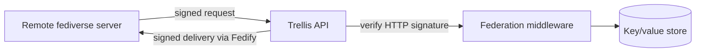

# ActivityPub federation

Trellis can participate in the fediverse over [ActivityPub](https://www.w3.org/TR/activitypub/),
the W3C standard for decentralised social networking. Federation is implemented
with [Fedify](https://fedify.dev/) and runs inside the same API service as the
rest of Trellis — there is no separate federation service to operate.

## Disabled by default

Federation is **off by default** and is enabled per environment through a
feature flag. This is a deliberate posture, not an oversight: federation means
sharing data with servers Trellis does not control, and that is a decision each
deploying application should make explicitly rather than inherit silently. When
the flag is off, federation routes are inert and no activities are sent or
accepted.

## Enablement controls

Because federation exposes social-graph information to other servers, Trellis
treats turning it on as a gated decision. The following controls are required to
be present and active before federation may be enabled in any environment.

> **Status.** These four controls describe the *enablement bar* for federation,
> not currently-shipped behaviour. In the present codebase the ActivityPub
> surface (actor, WebFinger, inbox/outbox, collections) is wired through Fedify,
> but the follower/following collections return a count via a `GraphService`
> stub (`// TODO: redesign`) and the secure-fetch, defederation deny-list, and
> distributed federation rate-limit controls are not yet implemented. Treat this
> section as the gate that must close before federation is switched on, and
> verify each control against the code before enabling it in any environment.

1. **Authorized fetch (secure mode).** Server-to-server requests for actor
   documents and collections must carry a valid HTTP signature, not just inbox
   deliveries. Unsigned or invalidly-signed requests receive a reduced response.
   This forces access to come from an identifiable, revocable federated actor
   rather than anonymous HTTP.

2. **Follower/following visibility control.** Each user controls whether their
   followers and following collections enumerate their members or return only a
   count. The privacy-preserving mode — count only — is the default. This is the
   single highest-value control against bulk social-graph harvesting.

3. **Instance deny/allow-list (defederation).** Operators can defederate
   hostile or abusive instances. Inbound activities from, and outbound delivery
   to, denied instances are refused, so a federation relationship can always be
   severed.

4. **Distributed rate limiting.** Federation traffic is rate-limited through
   shared, distributed infrastructure that holds across all running instances of
   the service, rather than a per-process in-memory window that could be bypassed
   by spreading requests.

Even with all four controls in place, a federated peer can retain whatever it is
legitimately sent. These controls reduce bulk harvesting; they cannot revoke
data already shared with a peer that was granted access. That residual reality
is exactly why federation is an explicit, per-deployment decision.

## How it works

ActivityPub endpoints live alongside the rest of the API. HTTP Signature
verification runs as route-specific middleware, keeping federation logic
isolated in its own module while sharing one process and one database pool.

Trellis exposes the standard ActivityPub surface — actor discovery via
[WebFinger](https://www.rfc-editor.org/rfc/rfc7033), actor documents, inbox and
outbox, and follower/following collections — for users, entities, and groups.
Fedify handles the web-standard `Request`/`Response` plumbing.

Incoming activities are authenticated, then handled inline. Outgoing activities
are delivered through Fedify's delivery path
(`apps/api/src/lib/activitypub/services/fedify-delivery.ts`); Fedify owns the
signing, fan-out, and retry mechanics. There is no separate Trellis-managed
outbox SQS queue in the shipped code.

### HTTP Signatures

Server-to-server authentication uses HTTP Signatures, the ActivityPub standard.
Trellis signs outgoing requests and verifies incoming ones automatically through
Fedify. Each user and entity gets an RSA key pair generated on creation, and a
short-lived nonce store guards against replay. Applications do not implement the
signing or verification mechanics themselves.

### Actor enrichment for extensions

Entity actors use type-aware identifiers, and extensions can add **display-only**
fields — a summary, an icon, property attachments — to an entity's actor
document through the `enrichActor` hook.

The core always owns the security-relevant fields of an actor document
(identity, public key, inbox/outbox, endpoints, preferred username). Extensions
can never override these, which prevents an extension from impersonating a
different actor.

## Turning federation on and off

Beyond the per-environment enablement gate, federation can be disabled at
runtime through a feature toggle. When disabled, federation routes stop serving,
no outgoing activities are enqueued, and incoming activities are dropped.

## See also

- [Architecture overview](architecture-overview.md) — where federation sits in the system
- [Graph and circles](graph-and-circles.md) — the relationship model behind follower/following collections
- [Async processing](async-processing.md) — the SQS queues and cron jobs behind background work
- [Security architecture](../security-and-privacy/security-architecture.md) — the broader security posture
