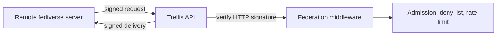

# ActivityPub federation

Trellis can participate in the fediverse over [ActivityPub](https://www.w3.org/TR/activitypub/),
the W3C standard for decentralised social networking. The federation surface
runs inside the same API service as the rest of Trellis — there is no separate
federation service to operate. Trellis implements the protocol handling itself
(HTTP Signatures, inbox admission, delivery); the [Fedify](https://fedify.dev/)
library is used for ActivityStreams vocabulary and serialisation.

## Disabled by default

Federation is **off by default** and is enabled per deployment with
`ACTIVITYPUB_ENABLED=true`. This is a deliberate posture, not an oversight:
federation means sharing data with servers Trellis does not control, and that is
a decision each deploying application should make explicitly rather than inherit
silently. When the flag is off, the federation-facing routes (actor, WebFinger,
inbox, outbox, collections, public ActivityPub objects) are never registered, so
the deployment exposes no federation surface at all; the authenticated `/api/*`
endpoints that share those modules stay on.

## Enablement controls

Because federation exposes social-graph information to other servers, Trellis
treats turning it on as a gated decision. The following controls are required to
be present and active before federation may be enabled in any environment.

| Control | Status |
|---|---|
| 1. Authorized fetch (secure mode) | Not implemented |
| 2. Follower/following visibility control | Not implemented — the collections return a count from a placeholder |
| 3. Instance deny-list (defederation) | Inbound implemented; outbound not yet |
| 4. Distributed rate limiting | Implemented |

1. **Authorized fetch (secure mode).** Server-to-server requests for actor
   documents and collections must carry a valid HTTP signature, not just inbox
   deliveries. Unsigned or invalidly-signed requests receive a reduced response.
   This forces access to come from an identifiable, revocable federated actor
   rather than anonymous HTTP.

2. **Follower/following visibility control.** Each user controls whether their
   followers and following collections enumerate their members or return only a
   count. The privacy-preserving mode — count only — is the default. This is the
   single highest-value control against bulk social-graph harvesting.

3. **Instance deny-list (defederation).** Operators can defederate hostile or
   abusive instances, so a federation relationship can always be severed.
   *Today:* `ACTIVITYPUB_BLOCKED_DOMAINS` (a comma- or space-separated list; an
   entry also blocks its subdomains, matched on label boundaries) refuses inbound
   activities from listed instances, and the check runs before any remote key is
   fetched. Outbound delivery to a listed instance is **not yet** refused, and the
   list is deployment configuration rather than something an operator can change
   at runtime.

4. **Distributed rate limiting.** Inbound federation traffic is limited per
   remote **instance domain** — not per actor, since actor URIs cost an attacker
   nothing to mint — through the shared token-bucket limiter, so the limit holds
   across all running replicas. The per-minute ceiling is
   `ACTIVITYPUB_INSTANCE_RATE_LIMIT` (default 60). Admission fails closed: if the
   limiter or the deny-list cannot be consulted, the activity is refused.

Even with all four controls in place, a federated peer can retain whatever it is
legitimately sent. These controls reduce bulk harvesting; they cannot revoke
data already shared with a peer that was granted access. That residual reality
is exactly why federation is an explicit, per-deployment decision.

### Boot-time guards

With `ACTIVITYPUB_ENABLED=true` the API refuses to start unless:

- `ACTIVITYPUB_KEY_ENCRYPTION_KEY` is set (32 bytes; actor private keys are
  encrypted at rest under it, with no fallback to the session secret), and
- the rate limiter has a shared backend (`KV_PROVIDER=postgres` or
  `RATE_LIMIT_TABLE`) — a per-process in-memory limiter would multiply the
  ceiling by the number of replicas.

### Remaining work before federation can be enabled

Beyond controls 1–3 above, these are not built yet:

- **Actor key provisioning.** The key-pair machinery exists, but no account,
  entity or group is given a key pair when it is created. Delivery refuses to
  send an unsigned request, so with federation switched on today no remote
  delivery would succeed.
- **An outbound delivery queue** with retries and per-domain bounds (today each
  delivery is a single attempt; see below).
- **A shared replay-protection store** across replicas (today's nonce cache is
  per process).
- **A pending-membership model for private groups**, so a remote follow of a
  private group is held for approval.

Treat this page as the gate that must close before federation is switched on,
and verify each item against the code before enabling it in any environment.

## How it works

ActivityPub endpoints live alongside the rest of the API. HTTP Signature
verification runs as route-specific middleware, keeping federation logic
isolated in its own module while sharing one process and one database pool.

Trellis exposes the standard ActivityPub surface — actor discovery via
[WebFinger](https://www.rfc-editor.org/rfc/rfc7033), actor documents, inbox and
outbox, and follower/following collections — for users, entities, and groups.

```mermaid
flowchart LR
    Remote[Remote fediverse server] -->|signed request| API[Trellis API]
    API -->|verify HTTP signature| MW[Federation middleware]
    MW --> Admit[Admission: deny-list, rate limit]
    API -->|signed delivery| Remote
```

Incoming activities are authenticated, admitted (deny-list, then the per-instance
rate limit), then handled inline. Outgoing activities are delivered by
`apps/api/src/lib/activitypub/services/fedify-delivery.ts` — despite the file
name, this is Trellis's own code: one signed `POST` per recipient inbox through
the SSRF-safe fetcher (`https:` only, no redirects, bounded time and response
size). There is **no retry and no queue** yet: fan-out to several inboxes runs in
parallel, and a failed delivery is logged and not retried. The
`federation-outbox` worker is a placeholder for the queue listed above.

### HTTP Signatures

Server-to-server authentication uses HTTP Signatures, the ActivityPub standard.
Trellis signs outgoing requests and verifies incoming ones in its own module
(`apps/api/src/lib/activitypub/http-signatures.ts`). Verification requires the
`date` header to be within five minutes and keeps a short-lived nonce cache to
reject replays. Each actor is designed to have its own RSA key pair, stored
encrypted under `ACTIVITYPUB_KEY_ENCRYPTION_KEY`; provisioning those keys is
still open (see above). Applications do not implement the signing or
verification mechanics themselves.

### Actor enrichment for extensions

Entity actors use type-aware identifiers, and extensions can add **display-only**
fields — a summary, an icon, property attachments — to an entity's actor
document through the `enrichActor` hook.

The core always owns the security-relevant fields of an actor document
(identity, public key, inbox/outbox, endpoints, preferred username). Extensions
can never override these, which prevents an extension from impersonating a
different actor.

## Turning federation on and off

`ACTIVITYPUB_ENABLED` is read once at startup, so switching federation on or off
is a redeploy. While it is on, the **standalone mode** feature toggle
(`activitypub_standalone_mode_enabled`) can be flipped at runtime: ActivityPub
features keep working locally, but no remote activities are delivered and no
remote fetches are made.

## See also

- [Architecture overview](architecture-overview.md) — where federation sits in the system
- [Graph and circles](graph-and-circles.md) — the relationship model behind follower/following collections
- [Async processing](async-processing.md) — the queues and cron jobs behind background work
- [Security architecture](../security-and-privacy/security-architecture.md) — the broader security posture
