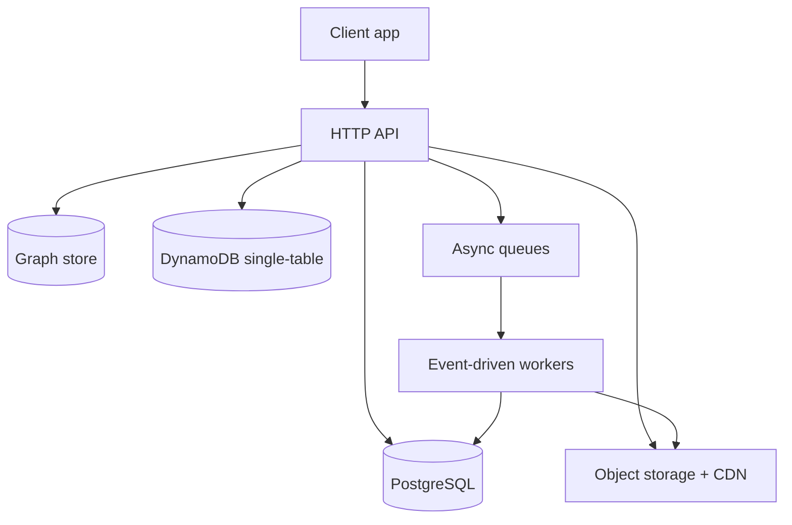

# Architecture overview

Trellis is a multi-tenant social-network platform core. It provides the
foundation — auth and identity federation, feeds, posts, comments, media,
moderation, and ActivityPub federation — that vertical applications build on by
registering extensions. This page is the entry point to the architecture: it
sketches the shape of the system and links to the concept pages that cover each
layer in depth.

## Shape of the system

Trellis runs as a long-lived HTTP API backed by a relational database, with
event-driven workers handling background jobs. Stateless request handling, a
single source of truth for transactional data, and asynchronous processing for
anything that doesn't need to block a response are the load-bearing ideas.

- **API** — a stateless HTTP service that owns request validation, auth, and
  business logic. See [Compute](compute.md).
- **PostgreSQL** — the source of truth for content, auth, media metadata, and
  transactional data, accessed through Prisma. See [Database](database.md).
- **Graph store** — scored relationships, circle membership, typed entity
  edges, and post-subject edges for visibility queries. See
  [Graph and circles](graph-and-circles.md).
- **DynamoDB single-table** — key/value and cache access patterns with TTL. See
  [DynamoDB single-table](dynamodb-single-table.md).
- **Object storage and CDN** — media originals and derivatives, served through
  a CDN. See [Storage and CDN](storage-and-cdn.md).
- **Async processing** — queues, scheduled jobs, and workers for work that runs
  outside the request path. See [Async processing](async-processing.md).

For the cross-cutting reasoning behind these choices — stateless handlers,
managed services, least privilege, observability — see
[System design](system-design.md).

## Design principles

- **Right tool for the workload.** A long-lived service handles the
  request/response API; event-driven workers handle background jobs.
- **Managed over self-hosted.** Lean on managed data and messaging services so
  there are no servers to patch.
- **Convention over configuration.** Sensible defaults and a small config
  surface.
- **Least privilege everywhere.** Fine-grained, per-component permissions rather
  than shared broad roles.
- **Observable by default.** Structured logging and tracing are part of the
  baseline, not an add-on.

## Entity-centric social model

The social layer is **entity-first**: entities — defined by the loaded domain
extension — are the primary social objects, not user metadata. Users have
relationships with entities; entities have typed relationships with other
entities; posts are *about* entities. Human-to-human relationships still exist,
but they are secondary.

The relational database stays the source of truth for content, auth, media, and
transactional data. The graph store holds the scored relationships, circle
membership, typed entity edges, and the post-subject edges needed for
dual-gated visibility queries. See [Graph and circles](graph-and-circles.md)
for the full model, schema, and write contract.

## Extension architecture

Trellis's core is domain-agnostic. Domain-specific behaviour is provided by
**extensions** — pluggable modules that register entity types, metadata
schemas, routes, feed strategies, recommendation strategies, lifecycle hooks,
entity relationship types, discovery facets, and relationship signal providers.

| Concept | Description |
|---------|-------------|
| `TrellisExtension` | Interface that every extension implements |
| `ExtensionContext` | Scoped context passed to extensions — limited database access, no secrets |
| `ExtensionDb` | Compile-time boundary exposing only safe data models, never auth or security tables |
| `ExtensionGraphService` | Read-only proxy over the graph layer — extensions can traverse edges but not write them |
| Extension Registry | Startup-validated list of loaded extensions |
| Hook Dispatcher | Fires lifecycle hooks (for example `onEntityCreated`) with a timeout and circuit breaker |

Extensions are separate workspace packages. See the
[glossary](../reference/glossary.md) for term definitions.

## Where to go next

- [System design](system-design.md) — cross-cutting principles and request flow
- [Compute](compute.md) — the API service and background workers
- [Database](database.md) — PostgreSQL, Prisma, migrations
- [Storage and CDN](storage-and-cdn.md) — media pipeline and delivery
- [Async processing](async-processing.md) — queues, schedules, and workers
- [DynamoDB single-table](dynamodb-single-table.md) — key design and access patterns
- [Graph and circles](graph-and-circles.md) — entity-centric model and visibility
- [ActivityPub federation](activitypub.md) — how Trellis participates in the fediverse
