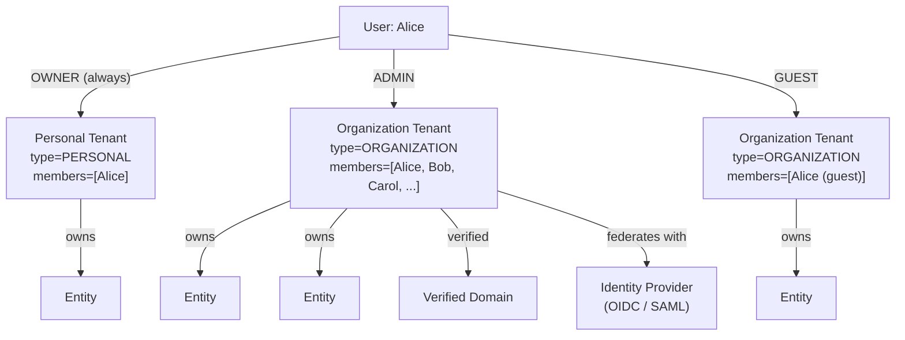

# Tenancy Model

Trellis is multi-tenant at its core. A **tenant** is the boundary that everything
else hangs off of: identity, resource ownership, roles, and audit scope all live
inside a tenant.

## What a tenant is

A tenant is the unit of:

- **Identity federation** — a tenant may federate with an external identity
  provider (IdP) so its members sign in through their own organization's SSO.
- **Domain ownership** — a tenant can own one or more verified DNS domains.
- **Resource scope** — every entity, post, comment, group, connection code, and
  ownership row belongs to exactly one tenant.
- **Role assignment** — roles and permissions are scoped to a tenant.
- **Audit scope** — security events are filtered by tenant for tenant
  administrators.

There is no "tenantless" data. Even an individual consumer's data lives under a
tenant.

## Tenant types

Two tenant types capture the operational difference between an individual and an
organization:

```typescript
enum TenantType {
  PERSONAL      // Auto-created on sign-up. One member. Not invitable.
  ORGANIZATION  // Explicitly created by a user. Multiple members. Can federate.
}
```

A **personal tenant** exists for every user, which keeps the data model uniform:
a user's entities, posts, and connection codes all live under their personal
tenant. A user is **always** a member of their own personal tenant and **may**
additionally be a member of zero or more organization tenants.

An **organization tenant** is created explicitly, can have many members, can
federate with an external IdP, and can own verified domains.

## Hierarchy

The model is deliberately flat: one tenant, one app context. A user belongs to a
tenant through a membership row that carries their role within that tenant.



A flat tenant keeps the model clean: one app, one URL per tenant, so there is no
intermediate "site" layer between a tenant and its resources.

## Single active tenant

A user can be a member of multiple tenants but is **active in exactly one at a
time**.

- The **active tenant** is the resource scope the API applies to the request.
- It is carried in the session token.
- Switching tenants is a deliberate action: the user calls
  `POST /api/auth/switch-tenant`, the server validates membership, and the next
  token refresh carries the new tenant ID.
- A user cannot read data from a tenant they are not currently active in, even
  if they are a member — they must switch first.

This design has two benefits:

- **Simple authorization.** Every endpoint scopes to one tenant ID sourced from
  the auth context, so there is no per-request "for tenant X" header that route
  handlers must validate.
- **No cross-tenant leakage.** Because the active tenant comes from the auth
  context, a query that forgets a tenant predicate is still implicitly scoped.

The trade-off is that switching tenants takes a token refresh, the same pattern
used by many SaaS apps.

## Resource ownership rule

> **Every resource owned by a tenant carries a non-nullable `tenantId` foreign
> key.**

Tenant-scoped resources include:

- `Entity`
- `Post`, `PostComment`
- `Group`, `GroupMember`
- `ConnectionCode`, `ConnectionCodeRedemption`
- `EntityOwnership`
- `Notification`

Some tables are intentionally **not** tenant-scoped:

- `User` — a user is a global identity that can belong to many tenants; tenant
  membership lives on `TenantMember`.
- `MediaFile` — content-addressed, so deduplication across tenants is fine.
- `FeatureToggle` — platform-wide.
- `RoleMetadata` — a global role catalog.

## Personal tenant invariants

A personal tenant follows tighter rules than an organization tenant:

| Property | Personal | Organization |
|---|---|---|
| Members | exactly 1 (the owner) | 1 or more |
| `slug` | system-assigned (`personal-<userId>`) | user-chosen, globally unique |
| Federated IdP | not allowed | optional |
| Verified domains | not allowed | 0 or more |
| Renamable | yes (slug change) | yes |
| Deletable | only via the account-deletion flow | only by the OWNER |
| Visible in tenant switcher | always shown for the user | shown when active |

A user cannot demote, suspend, or remove their own personal tenant in isolation;
it is removed as part of full account deletion.

## Glossary

These terms are used throughout the identity-federation concepts:

- **Tenant** — the top-level container described above.
- **Personal tenant** — an auto-created tenant of `type=PERSONAL` for one user.
- **Organization tenant** — an explicitly-created tenant of `type=ORGANIZATION`.
- **TenantMember** — the join row linking a user to a tenant with a role.
- **TenantDomain** — a verified DNS domain owned by a tenant.
- **TenantIdentityProvider** — the external IdP configured for a tenant.
- **TenantRole** — the role a user holds within a tenant: `OWNER`, `ADMIN`,
  `MEMBER`, `GUEST`.
- **Active tenant** — the tenant the user's current session operates under.
- **Discovery** — given an email or domain, deciding where to send the user to
  authenticate.
- **JIT** — just-in-time provisioning: a user row is created on the first
  successful federated authentication.

## Related

- [Roles and Permissions](./roles-and-permissions.md)
