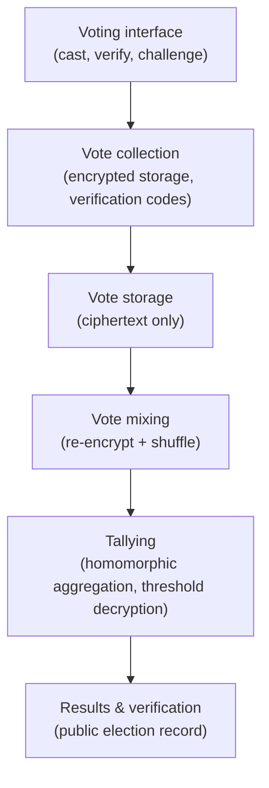

# Voting Design

Trellis supports verifiable, privacy-preserving voting: polls, elections, and
referendums in which ballots are encrypted end to end, each voter can confirm
their own ballot was counted, and anyone can verify the tally — without exposing
how any individual voted.

## How it fits together

A vote moves through distinct stages, each isolated from the next so that no
single component sees both a voter's identity and their plaintext selections:



- **Voting interface** — presents the ballot, captures selections, displays the
  voter's verification code, and offers vote verification and challenge.
- **Vote collection** — authenticates the voter, accepts the encrypted ballot
  with its proofs, and returns a verification code. Plaintext ballots are never
  stored.
- **Vote storage** — holds ciphertext and proofs. Voter participation is tracked
  separately from ballot content.
- **Vote mixing** — re-encrypts and shuffles ballots to break the link between a
  voter and their ballot.
- **Tallying** — homomorphically aggregates the mixed, encrypted ballots and
  decrypts only the final totals via threshold decryption.
- **Results & verification** — publishes the totals and a cryptographic election
  record that anyone can independently verify.

## Data model

The core entities:

```typescript
interface Election {
  id: string;
  title: string;
  description: string;
  electionType: "poll" | "election" | "referendum";
  status: "draft" | "open" | "closed" | "tallied" | "published";

  startTime: Date;
  endTime: Date;
  tallyTime?: Date;

  options: ElectionOption[];
  allowMultipleSelections: boolean;
  maxSelections?: number;
  allowVoteOverwriting: boolean;   // change vote while election is open

  publicKey: string;               // election encryption key
  trusteePublicKeys: string[];     // trustee keys for threshold decryption
  threshold: number;               // e.g. 3 of 5 trustees
  useVoteMixing: boolean;

  createdBy: string;
  createdAt: Date;
  updatedAt: Date;

  results?: ElectionResults;
  electionRecord?: string;
}

interface ElectionOption {
  id: string;
  electionId: string;
  label: string;
  description?: string;
  order: number;
}
```

A ballot stores only ciphertext, proofs, and a verification code — never the
voter's plaintext choices:

```typescript
interface EncryptedVote {
  id: string;
  electionId: string;
  voterId: string;

  encryptedSelections: EncryptedSelection[];
  ballotNonce: string;
  verificationCode: string;

  selectionProofs: ZeroKnowledgeProof[];   // each selection is 0 or 1
  ballotProof: ZeroKnowledgeProof;         // ballot respects selection limit

  castAt: Date;
  isChallenged: boolean;
  challengedAt?: Date;
  isOverwritten: boolean;
  overwrittenAt?: Date;
}

interface EncryptedSelection {
  optionId: string;
  encryptedValue: string;   // encryption of 0 or 1
  proof: ZeroKnowledgeProof;
}
```

Participation is recorded apart from ballot content, so "who voted" and "how they
voted" are never stored together:

```typescript
interface VoterParticipation {
  id: string;
  electionId: string;
  voterId: string;
  hasVoted: boolean;
  verificationCode?: string;
  castAt?: Date;
  challengedCount: number;
  // Contains no vote content.
}
```

Results carry the proofs needed to verify them:

```typescript
interface ElectionResults {
  electionId: string;
  totalVotes: number;
  optionResults: OptionResult[];
  challengeBallots: number;

  aggregationProof: ZeroKnowledgeProof;
  decryptionProofs: ZeroKnowledgeProof[];

  electionRecordHash: string;
  publishedAt: Date;
}

interface OptionResult {
  optionId: string;
  optionLabel: string;
  voteCount: number;
  percentage: number;
}
```

An append-only, hash-chained audit log records election events:

```typescript
interface AuditLog {
  id: string;
  timestamp: Date;
  eventType: AuditEventType;
  userId?: string;
  electionId?: string;
  details: Record<string, unknown>;
  signature: string;       // signature of the entry
  previousHash: string;    // hash of the previous entry (chain)
}
```

## API

### Cast a vote

```http
POST /api/voting/elections/:electionId/votes
```

Request: encrypted selections, a ballot nonce, the selection proofs, and the
ballot proof. Response: a `voteId`, the voter's `verificationCode`, and the cast
timestamp.

The endpoint requires an authenticated voter, rate-limits submissions,
cryptographically verifies the proofs, and stores no plaintext. If vote
overwriting is enabled, the voter's previous ballot is automatically
invalidated.

### Overwrite a vote

```http
POST /api/voting/elections/:electionId/votes/overwrite
```

Supplying the previous verification code along with a new encrypted ballot marks
the previous ballot overwritten and records the new one. This is allowed only
while the election is open. Vote overwriting provides coercion resistance: a
voter coerced into a choice can quietly recast later.

### Verify an individual vote

```http
GET /api/voting/verify/:verificationCode
```

A public endpoint — the verification code is the only identifier needed, and no
voter-identity information is returned. It reports whether the ballot was found,
whether it was included in the tally, and whether it was challenged or
overwritten.

### Challenge a ballot

```http
POST /api/voting/votes/:voteId/challenge
```

Providing the verification code (which proves ownership of the ballot) decrypts
and reveals the ballot's selections so the voter can confirm the device encrypted
their choice correctly. A challenged ballot is excluded from the tally, and the
voter may cast a fresh ballot afterward. This is the cast-or-challenge mechanism
that lets a voter audit the encryption their device performed.

### Election results

```http
GET /api/voting/elections/:electionId/results
```

Available once the election has closed. Returns the totals plus the complete
cryptographic election record and instructions for verifying it.

### Public verification

```http
GET /api/voting/elections/:electionId/verify
```

A public endpoint that returns the election record and a verification status
covering ballot-proof validity, aggregation validity, and decryption validity,
enabling independent third-party verification.

## Cryptographic operations

### Vote encryption

1. Generate a unique random nonce per ballot.
2. For each option, encrypt `1` if selected and `0` if not.
3. Generate zero-knowledge proofs that each encrypted selection is `0` or `1`.
4. Generate a ballot proof that the selections respect the election's selection
   limit.
5. Derive the verification code from the encrypted ballot and election ID.

### Vote mixing (anonymization)

1. Each mixing stage re-encrypts ballots with fresh randomness.
2. Ballots are shuffled to break the voter-to-ballot correlation.
3. Each stage emits a zero-knowledge proof that the shuffle was performed
   correctly.
4. Chaining multiple mixing stages strengthens the privacy guarantee.

### Vote aggregation

1. Homomorphic addition combines the encrypted ballots without decrypting any
   of them.
2. An aggregation proof attests the combination was performed correctly.

### Threshold decryption

1. Decrypting the final tally requires a threshold of trustees (e.g. 3 of 5).
2. Each participating trustee contributes a partial decryption.
3. The partial decryptions combine into the final totals.
4. A decryption proof accompanies each step.

No single trustee can decrypt the tally alone, and the per-step proofs let anyone
confirm each operation was carried out faithfully.

## Security model

### Client-side encryption

Encrypting ballots on the client keeps plaintext selections entirely off the
server, giving the strongest privacy guarantee. It requires a cryptographic
library in the client.

### Election keys

Election keys are generated per election. Trustee key shares back the threshold
decryption so that no single party holds the full decryption key, and a quorum is
required to reveal any totals.

### Privacy properties

- **Ballot secrecy** — storage holds only ciphertext; identity and ballot content
  are never stored together.
- **Voter verifiability** — each voter can confirm their ballot was counted using
  their verification code.
- **Universal verifiability** — anyone can verify the tally from the published
  election record and its proofs.
- **Coercion resistance** — vote overwriting lets a coerced voter recast while
  the election remains open.

## Further reading

For the security model — the cryptographic building blocks, the key ceremony,
separation of duties, and the threats this design guards against — see
[Voting security](voting-security.md).

For the formal protocol specification — ElGamal parameters, Chaum-Pedersen
proofs, mixing proofs, threshold decryption mathematics, and recommended security
parameters — see
[Voting — Cryptographic Protocols](../reference/voting-cryptographic-protocols.md).
