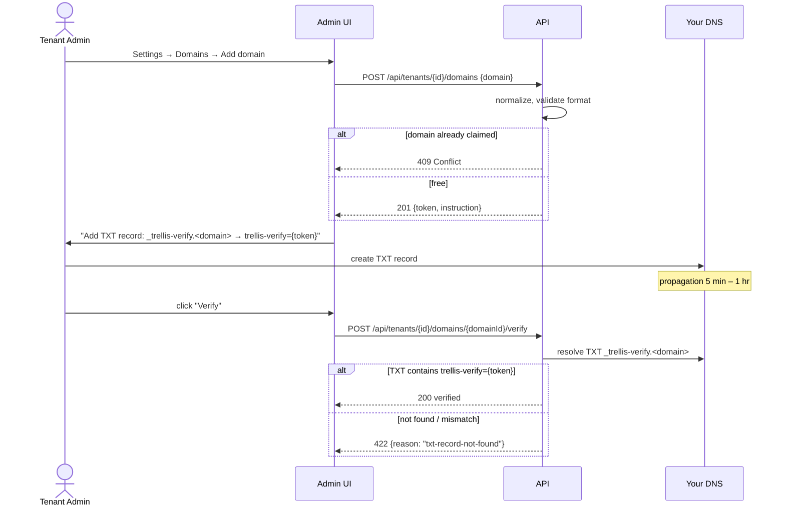
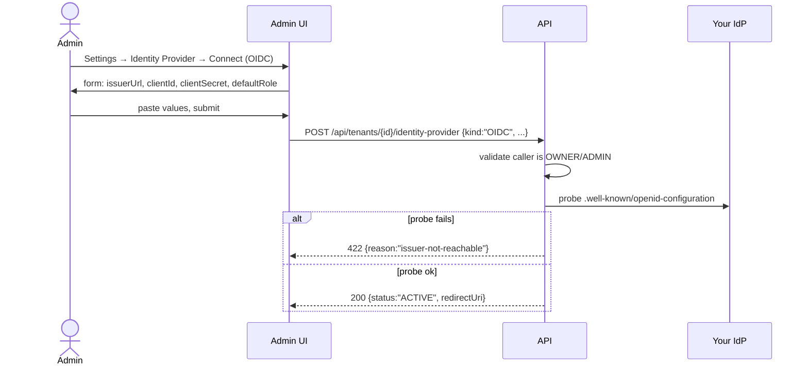
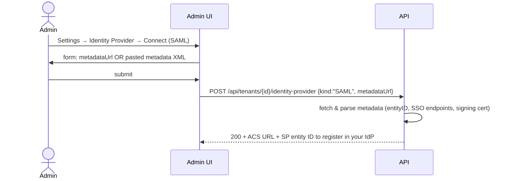
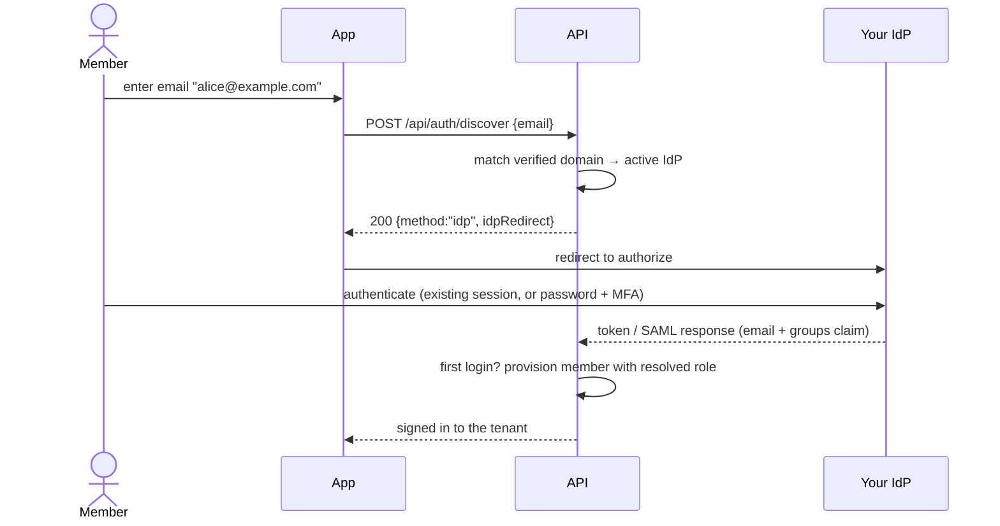

# Configure an identity provider for a tenant

This guide walks a tenant **owner or admin** through connecting a corporate
identity provider (IdP) so members of the organization can sign in with their
existing accounts. Trellis provisions members **just-in-time** on first login.

> **Status:** **OIDC is the shipped path.** The data model and this guide
> describe **SAML** as well, but the connect-IdP endpoint currently returns
> `501 SAML_NOT_AVAILABLE_IN_MVP` for `kind: "SAML"` — only `kind: "OIDC"` is
> accepted. Treat the SAML steps below as the planned design, not a working
> flow.

The flow has three stages:

1. **Verify a domain** you control (a DNS TXT record).
2. **Connect the IdP** (OIDC or SAML) and map attributes.
3. **Test the sign-in**, then enable federation for the rest of the org.

All steps are self-service through the admin settings UI and the API; no
support ticket is required.

## Prerequisites

- An **organization tenant**. If you only have a personal account, create one
  first (`POST /api/tenants` with a slug and display name); the creating user
  becomes the tenant **owner**.
- You are signed in as a tenant **owner** or **admin**.
- You can create a DNS TXT record for the domain your members' email addresses
  use (for example `example.com`).
- Admin access to your IdP (Entra, Okta, Google Workspace, Auth0, or any other
  standards-compliant OIDC/SAML provider) so you can register an application and
  copy its connection details.

## Fixed endpoints you will need

Every Trellis federation endpoint is the **same string for every tenant** —
Trellis routes by IdP record and your verified domain list, so there is no
tenant-specific URL to look up. Substitute your own deployment host for
`auth.example.com`.

| Value | Constant |
|---|---|
| OIDC redirect URI | `https://auth.example.com/oauth2/idpresponse` |
| SAML ACS / Reply URL | `https://auth.example.com/saml2/idpresponse` |
| SAML SP entity ID (audience) | provided by Trellis when you connect the IdP |
| Domain verification record | `_trellis-verify.<your-domain>` TXT |

## Step 1 — Verify your domain

Claiming a domain lets Trellis route sign-ins for that domain's email addresses
to your IdP, and proves ownership before federation goes live. Verification uses
a standard DNS TXT record.



1. Go to **Settings → Domains → Add domain** and enter the domain
   (for example `example.com`).
2. Trellis returns a verification token. Add the TXT record it shows you:

   ```
   _trellis-verify.example.com   TXT   "trellis-verify=<token>"
   ```

   The record always goes on the `_trellis-verify.<domain>` label, never on the
   apex — this avoids collisions with SPF, DKIM, and DMARC records.
3. Wait for DNS propagation (typically 5 minutes to 1 hour), then click
   **Verify**. Trellis resolves the TXT record and, on a match, marks the domain
   verified.

**Notes:**

- **One domain, one tenant.** If a domain is already claimed by another tenant,
  verification returns `409 Conflict` without revealing which tenant holds it.
- **Internationalized domains** are normalized to their A-label (punycode)
  before storage and lookup.
- **Each domain is claimed explicitly** — wildcard or parent-domain claims are
  not supported.
- **Removing a domain** that is the only verified domain on a tenant with an
  active IdP is blocked; disable the IdP first so you don't break sign-in
  routing.

You can verify more than one domain on the same tenant if your members use
multiple email domains.

## Step 2 — Connect the identity provider

Once at least one domain is verified, attach your IdP. Choose **OIDC** or
**SAML** depending on what your provider supports.

### Option A — OIDC



In **your IdP**, register an application first:

1. Create a new application / app registration named "Trellis".
2. Set the **redirect URI** to `https://auth.example.com/oauth2/idpresponse`.
   This is the same value for every tenant.
3. Create a **client secret** and copy the value (most IdPs show it only once).
4. Grant the standard scopes: `openid`, `email`, `profile`. To map groups to
   roles, also grant the permissions your IdP requires to read group membership.
5. Configure your IdP to emit a **groups claim** in the ID token if you want
   group-to-role mapping.

Then in **Trellis** (Settings → Identity Provider → Connect, OIDC), provide:

- **Issuer URL** — the OIDC issuer for your IdP (it exposes
  `.well-known/openid-configuration`).
- **Client ID** and **Client secret** from the app you registered.
- **Default role** to apply when no group matches (see
  [Map attributes and roles](#step-3--map-attributes-and-roles)).

Trellis probes the issuer's discovery document, stores the client secret
securely, and activates the provider. If the issuer is unreachable you get
`422 issuer-not-reachable` and nothing is saved.

### Option B — SAML

> **Not yet available.** Connecting a SAML IdP returns
> `501 SAML_NOT_AVAILABLE_IN_MVP` today; use OIDC. The flow below is the
> intended design.



1. In Trellis (Settings → Identity Provider → Connect, SAML), provide either a
   **metadata URL** or pasted **metadata XML** from your IdP. Trellis extracts
   the entity ID, SSO endpoints, and signing certificate.
2. Trellis returns two values to paste back into your IdP:
   - **ACS (Reply URL):** `https://auth.example.com/saml2/idpresponse`
   - **SP entity ID (audience):** the value Trellis displays after connecting.
3. Register those in your SAML IdP's application configuration.

## Step 3 — Map attributes and roles

Trellis ships sensible defaults using **standard OIDC and SAML claim names**, so
most IdPs work without custom claims:

- `email`, `email_verified`
- `given_name`, `family_name`
- `groups`

The default **attribute mapping** is `email → email`, `email → username`,
`given_name → given_name`, `family_name → family_name`, and `groups → groups`.
If your IdP uses different attribute names, edit the per-tenant attribute
mapping to remap them — no code change is required.

**Roles:**

- Define **group-to-role mappings** so an IdP group resolves to a tenant role
  (for example `ADMIN`, `MEMBER`, `GUEST`) when a member first signs in.
- Set a **default role** for members whose groups don't match any mapping. For
  OIDC this defaults to `MEMBER`; for SAML, sign-in is denied unless you set a
  default explicitly.
- If a member arrives with **no group claim at all**, Trellis applies the
  default role, or denies sign-in if no default is set.

## Step 4 — Test before you enforce

Run a full federation sign-in with your own account before relying on it for the
whole organization. Trellis tracks whether a successful test sign-in has
happened as a tenant **setup milestone** (`TEST_SIGN_IN`), so the admin UI can
confirm the round-trip worked. A test sign-in lets you confirm:

- that the IdP redirect and callback complete,
- the resolved tenant role (so you can check your group-to-role mapping), and
- which group identifiers your IdP emits (object IDs vs display names).

Doing this first catches misconfiguration while it affects only you, not all
your members.

> **Status:** A dedicated "test sign-in" *endpoint* that replays and surfaces
> the raw IdP claims is part of the planned admin surface but is not shipped as
> a standalone API today; the milestone above is detected from a real
> federated sign-in.

## How member sign-in works (just-in-time)

Once the IdP is active, a member signs in by entering their work email. Trellis
matches the email's domain to your verified domain, redirects to your IdP, and
provisions the member on first login.



The sign-in **discovery** endpoint takes only an email and tells the client
whether to use federation:

```http
POST /api/auth/discover
Content-Type: application/json

{ "email": "alice@example.com" }
```

Federated tenant:

```json
{
  "method": "idp",
  "idpRedirect": "https://auth.example.com/oauth2/authorize?identity_provider=...&response_type=code&scope=openid+email+profile",
  "tenantSlug": "your-tenant"
}
```

No matching domain or no active IdP:

```json
{ "method": "password" }
```

The discovery endpoint **never reveals whether an email account exists** — it
only reflects whether the email's domain is claimed by a federated tenant, which
is already public information once you publish the DNS TXT record.

**Sign-in edge cases:**

- **Email not on a verified domain.** If a member authenticates at the IdP but
  their email is not on one of your verified domains, Trellis rejects the
  federation attempt. It never auto-creates a member from a domain mismatch.
- **Existing password user, federation later enabled.** On their next sign-in
  through the IdP, Trellis links the federated identity to the existing account
  matched by email.

## Day-to-day operations

You can run these yourself, without a support ticket:

- **Rotate the IdP client secret.** Update the secret in your IdP, paste the new
  value into Trellis, and save. The previous version is retained briefly for
  rollback.
- **Force-revoke a member's session.** Removing a member signs them out
  globally, effective within seconds.
- **Disable the IdP without deleting it.**
  `PATCH /api/tenants/{id}/identity-provider {status:"DISABLED"}` stops routing
  to the provider while retaining its configuration, so re-enabling later is
  fast.
- **Export the audit log.**
  `GET /api/tenants/{id}/audit?from=...&to=...&format=csv`.

When you leave, you can disconnect your IdP and export your audit log
self-service, and queue a tenant-deletion request for confirmation — none of
these require involving the Trellis team.

## Invite members without an IdP

Organization tenants that don't federate add members by email invitation
instead: an admin sends an invitation with an email and role, the invitee
follows a signed link, signs up if needed, and is added to the tenant on accept.

> **Status:** The `TenantInvitation` data model backs this flow, but the
> tenant-scoped invitation **endpoint** (`POST /api/tenants/{id}/invitations`)
> is not yet shipped. The currently available invitation surface is the
> platform-level `/api/invitations` (a separate `Invitation` system used at
> sign-up). Treat the tenant-scoped invitation flow as design-only until the
> route lands.
