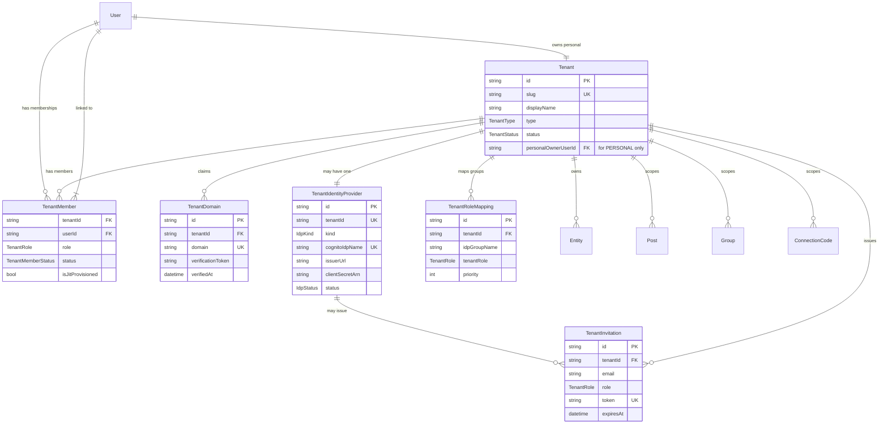

# Identity federation data model

Trellis is multi-tenant. Every user has a personal tenant, and may additionally
belong to one or more organization tenants. An organization tenant can federate
authentication to its own identity provider (IdP) over SAML or OIDC. This page
describes the data model that backs tenancy and federation.

## Entity relationships



## Tenant

A tenant is either `PERSONAL` (one per user, owned by that user) or
`ORGANIZATION` (owned via a member with the `OWNER` role).

```prisma
model Tenant {
  id            String        @id @default(cuid())
  slug          String        @unique // url-safe, 3–32 chars, [a-z0-9-]
  displayName   String        @map("display_name")
  type          TenantType
  status        TenantStatus  @default(ACTIVE)

  // PERSONAL tenants only: the single owner; equals the User.id that created it.
  // For ORGANIZATION tenants this is null; ownership is encoded via
  // TenantMember.role = OWNER.
  personalOwnerUserId String? @unique @map("personal_owner_user_id")

  createdAt     DateTime      @default(now()) @map("created_at")
  updatedAt     DateTime      @updatedAt @map("updated_at")
  suspendedAt   DateTime?     @map("suspended_at")
  suspendReason String?       @map("suspend_reason")

  members          TenantMember[]
  domains          TenantDomain[]
  identityProvider TenantIdentityProvider?
  roleMappings     TenantRoleMapping[]
  invitations      TenantInvitation[]
  entities         Entity[]
  posts            Post[]
  groups           Group[]
  connectionCodes  ConnectionCode[]

  @@index([slug])
  @@index([type, status])
  @@map("tenants")
}

enum TenantType {
  PERSONAL
  ORGANIZATION
}

enum TenantStatus {
  ACTIVE
  SUSPENDED
  DELETING
}
```

## TenantMember

Links a user to a tenant with a role and status. The `isJitProvisioned` flag
records whether the membership was created automatically on first federated
login.

```prisma
model TenantMember {
  id        String              @id @default(cuid())
  tenantId  String              @map("tenant_id")
  userId    String              @map("user_id")
  role      TenantRole
  status    TenantMemberStatus  @default(ACTIVE)

  isJitProvisioned Boolean   @default(false) @map("is_jit_provisioned")
  invitedByUserId  String?   @map("invited_by_user_id")
  invitedAt        DateTime? @map("invited_at")
  joinedAt         DateTime? @map("joined_at")
  removedAt        DateTime? @map("removed_at")
  lastActiveAt     DateTime? @map("last_active_at")

  tenant    Tenant @relation(fields: [tenantId], references: [id], onDelete: Cascade)
  user      User   @relation("TenantMemberships", fields: [userId], references: [id], onDelete: Cascade)
  invitedBy User?  @relation("TenantInvitedBy", fields: [invitedByUserId], references: [id])

  @@unique([tenantId, userId])
  @@index([userId])
  @@index([tenantId, status])
  @@index([tenantId, role])
  @@map("tenant_members")
}

enum TenantRole {
  OWNER  // exactly one per organization tenant; cannot be removed without transfer
  ADMIN  // manages members, IdP config, and domains
  MEMBER // posts and uses entities within tenant scope
  GUEST  // read-only or restricted
}

enum TenantMemberStatus {
  INVITED   // invitation issued, not yet accepted
  ACTIVE
  SUSPENDED // a tenant admin paused this member
  REMOVED
}
```

## TenantDomain

A tenant may claim multiple domains. Each domain is verified independently.
Email-domain routing to a tenant's IdP works when the email domain matches any
verified domain on the tenant.

```prisma
model TenantDomain {
  id                String    @id @default(cuid())
  tenantId          String    @map("tenant_id")
  domain            String    @unique // lowercased, no protocol
  verificationToken String    @map("verification_token") // random hex token
  // The token expires 7 days after creation; an admin must re-claim if it lapses.
  tokenExpiresAt    DateTime  @map("token_expires_at")
  verifiedAt        DateTime? @map("verified_at")
  verifyAttemptedAt DateTime? @map("verify_attempted_at")
  verifyAttempts    Int       @default(0) @map("verify_attempts")
  createdAt         DateTime  @default(now()) @map("created_at")

  tenant Tenant @relation(fields: [tenantId], references: [id], onDelete: Cascade)

  @@index([tenantId])
  @@index([verifiedAt])
  @@index([tokenExpiresAt])
  @@map("tenant_domains")
}
```

## TenantIdentityProvider

Holds a tenant's federated IdP configuration — SAML or OIDC. At most one IdP
record exists per tenant.

```prisma
model TenantIdentityProvider {
  id             String  @id @default(cuid())
  tenantId       String  @unique @map("tenant_id")

  kind           IdpKind
  // The provider record name in the identity service. Max 32 chars, unique
  // within the pool. Convention: "tenant-{tenant-id}", the cuid truncated to
  // 25 chars so "tenant-" + id stays within the 32-char quota.
  cognitoIdpName String  @unique @map("cognito_idp_name")

  // SAML configuration
  metadataUrl    String? @map("metadata_url")          // public XML metadata URL (auto-refresh)
  metadataXml    String? @map("metadata_xml") @db.Text // pasted XML when no URL

  // OIDC configuration
  issuerUrl      String? @map("issuer_url")
  clientId       String? @map("client_id")
  // The OIDC client secret is never stored in the database; the row holds only
  // a reference to the managed secret.
  clientSecretArn String? @map("client_secret_arn")
  scopes          String  @default("openid email profile groups")

  // Maps IdP claims to user attributes (JSON). Keys are attribute names; values
  // are IdP claim names, e.g. { "email": "email", "custom:groups": "groups" }.
  attributeMapping Json @default("{}") @map("attribute_mapping")

  status      IdpStatus @default(PENDING)
  enabledAt   DateTime? @map("enabled_at")
  lastError   String?   @map("last_error") @db.Text
  lastErrorAt DateTime? @map("last_error_at")

  createdAt DateTime @default(now()) @map("created_at")
  updatedAt DateTime @updatedAt @map("updated_at")

  tenant Tenant @relation(fields: [tenantId], references: [id], onDelete: Cascade)

  @@index([cognitoIdpName])
  @@index([status])
  @@map("tenant_identity_providers")
}

enum IdpKind {
  SAML
  OIDC
}

enum IdpStatus {
  PENDING   // configured, not yet enabled
  ACTIVE    // accepting logins
  DISABLED  // paused by a tenant admin
  ERROR     // last federation attempt failed; see lastError
}
```

**Provider record name.** The identity service addresses provider records by
name, with a 32-character limit. A prefix plus a truncated tenant id yields a
stable, deterministic mapping from tenant to provider record that stays within
the limit.

**Secrets are referenced, not stored.** OIDC client secrets are bearer
credentials. The database row carries only a reference to a managed secret,
which provides rotation, scoped read access, and access auditing.

## TenantRoleMapping

Maps an IdP-side group identifier to a tenant role. When a user belongs to
several groups that map to different roles, the mapping with the lowest
`priority` value wins.

```prisma
model TenantRoleMapping {
  id           String     @id @default(cuid())
  tenantId     String     @map("tenant_id")

  // The IdP-side group identifier. For SAML, the value of the group/role claim.
  // For OIDC, typically the group object id or display name, depending on what
  // the tenant admin maps in their IdP.
  idpGroupName String     @map("idp_group_name")

  tenantRole   TenantRole @map("tenant_role")

  // Lower value wins when a user is in multiple mapped groups.
  priority     Int        @default(100)

  createdAt    DateTime   @default(now()) @map("created_at")
  updatedAt    DateTime   @updatedAt @map("updated_at")

  tenant Tenant @relation(fields: [tenantId], references: [id], onDelete: Cascade)

  @@unique([tenantId, idpGroupName])
  @@index([tenantId, priority])
  @@map("tenant_role_mappings")
}
```

A tenant admin manages these mappings (for example, `Admins → ADMIN`,
`Members → MEMBER`). Users in no mapped group fall through to the IdP's default
role if one is configured, or are denied access otherwise.

## TenantInvitation

For organizations without an IdP, invitations are how members join: an email
invite is issued and the recipient accepts it. For organizations with an IdP,
just-in-time provisioning replaces invitations for users in the federated
domain.

```prisma
model TenantInvitation {
  id               String    @id @default(cuid())
  tenantId         String    @map("tenant_id")
  email            String    // invitee email
  role             TenantRole
  token            String    @unique // one-shot signed or opaque token
  expiresAt        DateTime  @map("expires_at")
  acceptedAt       DateTime? @map("accepted_at")
  acceptedByUserId String?   @map("accepted_by_user_id")

  invitedByUserId String   @map("invited_by_user_id")
  createdAt       DateTime @default(now()) @map("created_at")

  tenant     Tenant @relation(fields: [tenantId], references: [id], onDelete: Cascade)
  invitedBy  User   @relation("TenantInvitationInviter", fields: [invitedByUserId], references: [id])
  acceptedBy User?  @relation("TenantInvitationAcceptedBy", fields: [acceptedByUserId], references: [id])

  @@unique([tenantId, email])
  @@index([token])
  @@index([email])
  @@index([expiresAt])
  @@map("tenant_invitations")
}
```

## Tenant scoping on existing models

### User

```prisma
personalTenantId String? @unique @map("personal_tenant_id")
// FK to the user's personal Tenant. Set when the user is created. Nullable to
// allow the brief window during sign-up before the personal tenant exists.

personalTenant Tenant? @relation("PersonalTenantOwner", fields: [personalTenantId], references: [id])

tenantMemberships    TenantMember[]      @relation("TenantMemberships")
invitedTenantMembers TenantMember[]      @relation("TenantInvitedBy")
sentInvitations      TenantInvitation[]  @relation("TenantInvitationInviter")
acceptedInvitations  TenantInvitation[]  @relation("TenantInvitationAcceptedBy")
```

The global `User.role` enum is the platform-wide role (`END_USER`,
`B2B_PARTNER`, `PARTNER_ADMIN`, `INTERNAL`, `CONTENT_CREATOR`, `MODERATOR`,
`SUPER_ADMIN`) and is independent of tenant membership. It is retained so
platform-level checks (`SUPER_ADMIN` / `INTERNAL`) do not require a join through
`TenantMember` on every request.

### Entity, Post, Group, ConnectionCode, Notification

Every tenant-scoped model carries a `tenantId` foreign key and an index on it.

```prisma
// Entity
tenantId String @map("tenant_id")
tenant   Tenant @relation(fields: [tenantId], references: [id])
@@index([tenantId])
@@index([tenantId, entityType, status])
```

```prisma
// Post
tenantId String @map("tenant_id")
@@index([tenantId, createdAt])
```

`Post.tenantId` is set to the active tenant at authoring time. A single author
can have posts spread across their personal tenant and organization tenants;
the rows live in the same table, and every read query filters by `tenantId`.
Every entity belongs to exactly one tenant — cross-tenant ownership is
forbidden, enforced in the handler before the write.

`Group`, `ConnectionCode`, and `Notification` follow the same pattern: a
`tenantId` foreign key and index.

## Indexing notes

- **`(tenantId, …)` composite indexes** back most queries, since a tenant
  predicate typically begins the query plan and cuts the working set
  immediately.
- **`tenants.slug`** is the public-facing identifier used on every sign-up and
  sign-in routing call; it is unique.
- **`tenant_members.(tenantId, status)`** backs "active members of a tenant"
  listings.
- **`tenant_members.userId`** backs "tenants this user belongs to", which drives
  the tenant switcher.

## Related

- [Cognito federation](./cognito-federation.md)
- [Just-in-time provisioning](./just-in-time-provisioning.md)
