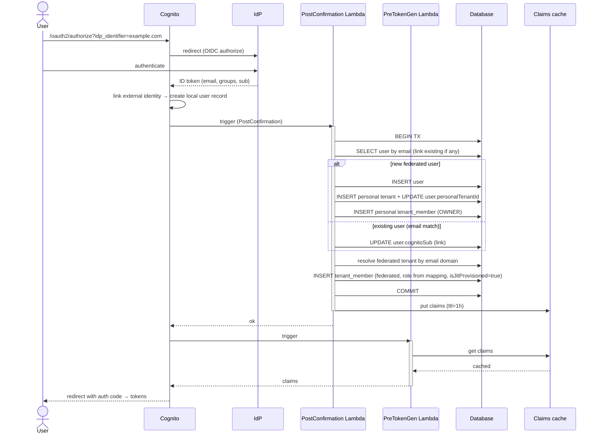

# Just-in-time provisioning

When a federated user authenticates for the first time, Trellis creates their
`User` and `TenantMember` rows automatically — no prior invitation is needed.
Subsequent logins refresh existing state rather than recreating it.

This page describes the provisioning path, deprovisioning, account linking, and
the edge cases. See [Cognito federation](./cognito-federation.md) for the
surrounding token flow and the
[identity federation data model](./identity-federation-data-model.md) for the
schema.

## The path

A federated user authenticates through their IdP. Cognito creates a local user
record in the pool and fires the PostConfirmation trigger, which does the
one-time provisioning. The PreTokenGeneration trigger then resolves the token
claims.



## Two triggers, two responsibilities

| Trigger | When | What it does |
|---|---|---|
| **PostConfirmation** | After Cognito accepts the user (post-signup or post-federated-confirm) | One-shot: create the user, personal tenant, and tenant membership. Idempotent. |
| **PreTokenGeneration** | On every token issuance and refresh | Read or refresh claims from the cache, fall back to the database, write claims to the token. |

PostConfirmation fires **once per Cognito user record** — the first time a
federated identity authenticates — so it is the right place for the heavier
provisioning work.

## PostConfirmation trigger

```typescript
import { CognitoUserPoolTriggerHandler } from 'aws-lambda';

export const handler: CognitoUserPoolTriggerHandler = async (event) => {
  const sub         = event.userName;
  const userAttrs   = event.request.userAttributes;
  const email       = userAttrs.email?.toLowerCase();
  const isFederated = !!userAttrs['identities'];
  const idpGroups   = (userAttrs['custom:idpGroups'] ?? '').split(',').filter(Boolean);

  if (!email) {
    console.error('post-confirm: no email; skipping');
    return event;
  }

  await db.$transaction(async (tx) => {
    // 1. Upsert the user.
    let user = await tx.user.findFirst({ where: { email } });
    if (!user) {
      user = await tx.user.create({
        data: {
          email,
          cognitoSub: sub,
          role: isFederated ? 'B2B_PARTNER' : 'END_USER',
          handle: deriveHandle(email),
        },
      });
    } else if (!user.cognitoSub) {
      // Existing email that never signed in via Cognito — link the identity.
      user = await tx.user.update({ where: { id: user.id }, data: { cognitoSub: sub } });
    }

    // 2. Ensure a personal tenant.
    if (!user.personalTenantId) {
      const personalTenant = await tx.tenant.create({
        data: {
          slug: `personal-${user.id}`,
          displayName: user.handle,
          type: 'PERSONAL',
          personalOwnerUserId: user.id,
          members: { create: { userId: user.id, role: 'OWNER', status: 'ACTIVE' } },
        },
      });
      await tx.user.update({
        where: { id: user.id },
        data: { personalTenantId: personalTenant.id },
      });
    }

    // 3. Federated path: resolve the tenant by domain, JIT-provision membership.
    if (isFederated) {
      const domain = email.split('@')[1];
      const tenantDomain = await tx.tenantDomain.findUnique({
        where: { domain },
        include: { tenant: { include: { identityProvider: true, roleMappings: true } } },
      });
      if (!tenantDomain || !tenantDomain.verifiedAt) {
        // Federated login but no matching verified domain — skip the org JIT.
        // The personal tenant and user still exist.
        console.warn(`federated user ${email} has no verified domain match`);
        return;
      }
      const tenant = tenantDomain.tenant;
      if (!tenant.identityProvider || tenant.identityProvider.status !== 'ACTIVE') {
        console.warn(`federated user ${email}: tenant ${tenant.slug} has no active IdP`);
        return;
      }

      const tenantRole = resolveRole(idpGroups, tenant.roleMappings, /* defaultRole */ 'MEMBER');
      if (!tenantRole) {
        // No matching role and no default — don't insert a membership. The user
        // gets a "no active tenant" claim and tenant-scoped endpoints return 403.
        console.warn(`federated user ${email}: no matching role; denying`);
        return;
      }

      await tx.tenantMember.upsert({
        where: { tenantId_userId: { tenantId: tenant.id, userId: user.id } },
        create: {
          tenantId: tenant.id,
          userId: user.id,
          role: tenantRole,
          status: 'ACTIVE',
          joinedAt: new Date(),
          isJitProvisioned: true,
        },
        update: {
          role: tenantRole,        // refresh from groups
          status: 'ACTIVE',
          lastActiveAt: new Date(),
        },
      });
    }
  });

  return event;
};
```

The transaction is essential: a half-created user is worse than none. If it
fails, the trigger throws, Cognito treats the confirmation as failed, and the
user sees an error rather than a partially provisioned state.

## PreTokenGeneration trigger

```typescript
import { CognitoUserPoolTriggerHandler } from 'aws-lambda';

export const handler: CognitoUserPoolTriggerHandler = async (event) => {
  const sub = event.userName;

  let claims = await dynamoCache.get(sub);
  if (!claims) {
    claims = await loadClaimsFromRds(sub);
    await dynamoCache.put(sub, claims, 3600);
  }

  // Re-resolve the role on each issuance — the group claim may have changed.
  const idpGroupsRaw = event.request.userAttributes['custom:idpGroups'];
  if (idpGroupsRaw && claims.activeTenantId) {
    const idpGroups = idpGroupsRaw.split(',').filter(Boolean);
    const refreshed = await maybeRefreshRole(claims.userId, claims.activeTenantId, idpGroups);
    if (refreshed) {
      claims.tenantRole = refreshed;
      await dynamoCache.put(sub, claims, 3600);
    }
  }

  event.response = {
    claimsOverrideDetails: {
      claimsToAddOrOverride: {
        'custom:userId':         claims.userId,
        'custom:globalRole':     claims.globalRole,
        'custom:activeTenantId': claims.activeTenantId ?? '',
        'custom:tenantSlug':     claims.tenantSlug ?? '',
        'custom:tenantRole':     claims.tenantRole ?? '',
        'custom:handle':         claims.handle,
      },
    },
  };
  return event;
};
```

`maybeRefreshRole` is a fast read-only path: it queries `TenantRoleMapping`,
compares against the current `tenant_members.role`, and updates if changed. This
catches the case where an admin changes a role mapping while a user holds a
valid token — on the next refresh (within the cache TTL), the role updates
without forcing a sign-out.

## Active tenant for a federated user

When a federated user signs in for the first time, their **federated tenant** is
the active tenant — they arrived through the IdP redirect for organization work.
A tenant switcher lets them flip to their personal tenant.

## Account linking

If a user signed up with a password (creating a `User` row and personal tenant)
and their organization later connects an IdP for that domain, the user can sign
in through the IdP. Cognito links the federated identity to the existing pool
user by email, and the PostConfirmation logic links the identity in the `User`
table by matching email.

Both paths coexist for that user — Trellis does not automatically delete or
migrate the password path. The user can disable password auth in their settings.
Mixing both methods reduces the security guarantees, because the tenant's MFA
enforcement applies only to the federated path.

## Deprovisioning

### Admin removes a member

```http
DELETE /api/tenants/{tenantId}/members/{memberId}
```

In one transaction:

- `tenant_members.status = 'REMOVED'`, `removedAt = NOW()`.
- The claims cache is invalidated for the user's Cognito subject.
- `AdminUserGlobalSignOut` revokes the user's existing tokens.

The user's `User` row, personal tenant, and other memberships are untouched;
they simply lose access to that federated tenant.

### IdP-side group change

If the IdP removes a user from a group that mapped to a higher role, the next
token refresh re-resolves the role via `maybeRefreshRole` and the user is
gracefully demoted. If they are removed from all mapped groups, they fall
through to the default role; with no default role configured, they are denied —
the pre-token-generation trigger returns a "no active tenant" claim and every
tenant-scoped endpoint returns 403.

### IdP-side user disable

When the IdP disables a user, it stops issuing tokens to Cognito. Existing
Cognito tokens remain valid until they expire, so Trellis relies on:

- A short access-token TTL (one hour), so a disabled user loses access quickly.
- Refresh-token failure: once the IdP returns an authentication error, the
  federated session can no longer refresh, and the user is effectively signed
  out.

### Tenant disconnects its IdP

When a tenant disables its IdP (`status = DISABLED`):

- All federated members lose sign-in capability.
- Existing tokens remain valid until they expire.
- `tenant_members` rows are **not** deleted — membership is the source of truth
  and is preserved for re-enable.
- `AdminUserGlobalSignOut` is called for all active federated members to sign
  them out proactively.

## Edge cases

| Scenario | Behaviour |
|---|---|
| Federated user, email not on any verified domain | PostConfirmation logs a warning and creates the user and personal tenant only. They can use Trellis as a consumer but not as an org member. |
| Multiple verified domains matching across tenants | Not possible: domains are unique across all tenants. If somehow seen, the JIT is refused and an error is logged. |
| User changes email at the IdP | The new email surfaces on the next token; `users.email` is updated in PreTokenGeneration. Membership is not auto-moved to a different tenant — that requires admin action. |
| Pool user exists but the database row is missing | PreTokenGeneration logs the drift and returns minimal claims (no userId, no tenantId); all API calls return 403 until reconciled. |
| Unrecognized group-claim format | Best-effort split on comma, semicolon, or space. If still unparseable, fall back to the default role and write an audit-log entry. |
| User REMOVED from a tenant but holding a valid token | On the next refresh, `tenant_members.status != ACTIVE` yields an empty `activeTenantId`; tenant-scoped endpoints return 403. |

## Idempotency

The PostConfirmation trigger must be safely retriable:

- All writes use upserts (`upsert`, or `findFirst` then `create`) rather than
  blind inserts.
- Unique constraints (such as `@@unique([tenantId, userId])`) catch any
  double-creation race.
- Cache writes are last-write-wins.

Cognito retries a failed trigger with backoff. Two things keep state consistent:

1. The PostConfirmation transaction is all-or-nothing.
2. PreTokenGeneration's database fallback runs the same provisioning logic on the
   next token request if PostConfirmation never completed — a safety net, not
   the primary path.
