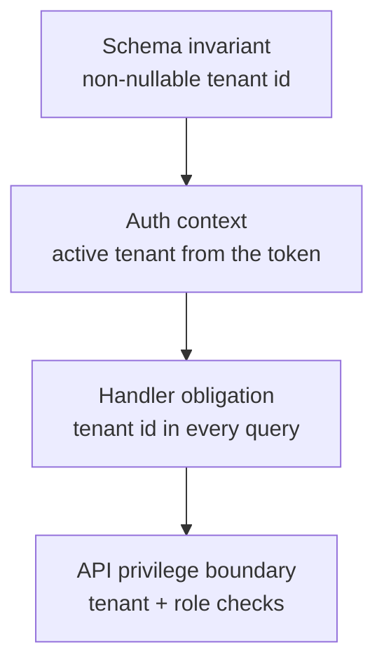

# Tenant isolation

Trellis is multi-tenant by design, and it assumes a hostile environment: it must
hold even when one tenant actively tries to reach another's data. The core
guarantee is simple to state:

> A query for tenant A's data, executed in the context of tenant B, returns
> nothing.

That guarantee is enforced at several independent layers, so that no single
mistake collapses the isolation.

## Layered enforcement

### Schema invariant

Every tenant-scoped table carries a non-nullable tenant identifier with a
foreign key to the tenants table. A row simply cannot exist without belonging to
exactly one tenant, and cross-tenant foreign keys do not exist — so a record in
one tenant cannot reference a record in another.

### Auth context

Every authenticated request carries its **active tenant** as a signed claim in
the token. The claim is part of the token's signature, so it cannot be altered
without re-authenticating. Middleware refuses to build an authenticated context
when the claim is absent, treating such a request as anonymous.

### Handler obligation

Every handler that reads or writes a tenant-scoped table includes the active
tenant in the query predicate. This is enforced through code review, static
analysis that flags tenant-scoped queries missing the predicate, and an
integration test fixture that seeds two tenants with identical data shapes and
asserts that a request authenticated as one tenant never sees the other's data.

### API privilege boundary

At the API layer, a request is checked in order: the token is verified and the
active tenant extracted; the active tenant must match the tenant addressed by the
route; the caller's role must carry the capability the operation requires; and
only then does the handler run its tenant-scoped query.

A failure at any step returns a generic refusal. The response is the same whether
the tenant mismatched or the role was insufficient, so the boundary leaks no
information about why access was denied. Reads of another tenant's resource
return "not found" rather than "forbidden," so the boundary does not even confirm
that a resource exists.

## Cross-tenant access is "no" by design

A user who belongs to two tenants still cannot carry data across them. A resource
created while acting in one tenant belongs to that tenant; it cannot be
referenced from the other, because the schema invariant forbids cross-tenant
references. Sharing a resource between tenants would require an explicit,
separately designed sharing mechanism with its own grants and revocation — it is
never implicit.

## Identity-provider secret handling

When a tenant connects its own identity provider, the sensitive material
(client secrets, provider metadata) is kept in a managed secret store, encrypted
at rest, never in the application database and never alongside tenant content.
The application database holds only references, not the secrets themselves.
Secrets are never written to logs, telemetry, or error reports.

## Identity-federation hardening

Tenant onboarding and federated login are hardened against the obvious abuse
paths:

- **Domain ownership** is proven by a DNS TXT record containing a
  cryptographically random token; no other DNS record type is accepted, and a
  domain can belong to exactly one tenant at a time. Public-suffix domains
  (free webmail domains, registries) cannot be claimed.
- **Identity-provider responses** are signature-validated; unsigned responses
  are rejected. Group claims used for role assignment are validated as part of
  the signed assertion before any role is derived from them.
- **Role mapping cannot escalate beyond a tenant.** A tenant's role mappings can
  only assign roles within that tenant; platform-level roles are global and not
  reachable through tenant configuration.
- **Federated login is scoped to matched domains.** A login from an address that
  matches no verified tenant domain does not provision membership in any tenant.

## Audit trail

Every administrative action on identity and tenancy surfaces is recorded — who
did what, to which tenant, and when. The audit log records *that* a federated
login succeeded and which provider resolved which role; it never records the raw
claim values, which can themselves be sensitive. Tenant admins can review their
own tenant's events; cross-tenant visibility is reserved for platform
administrators and is itself audited.

For the broader security posture these controls build on, see
[Security architecture](security-architecture.md). For regulatory alignment, see
[Compliance](compliance.md).
